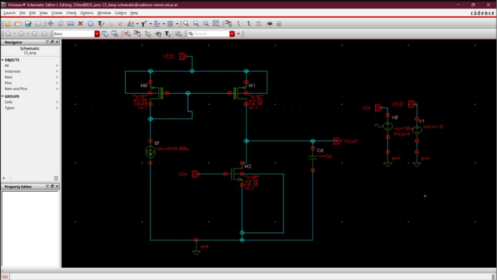
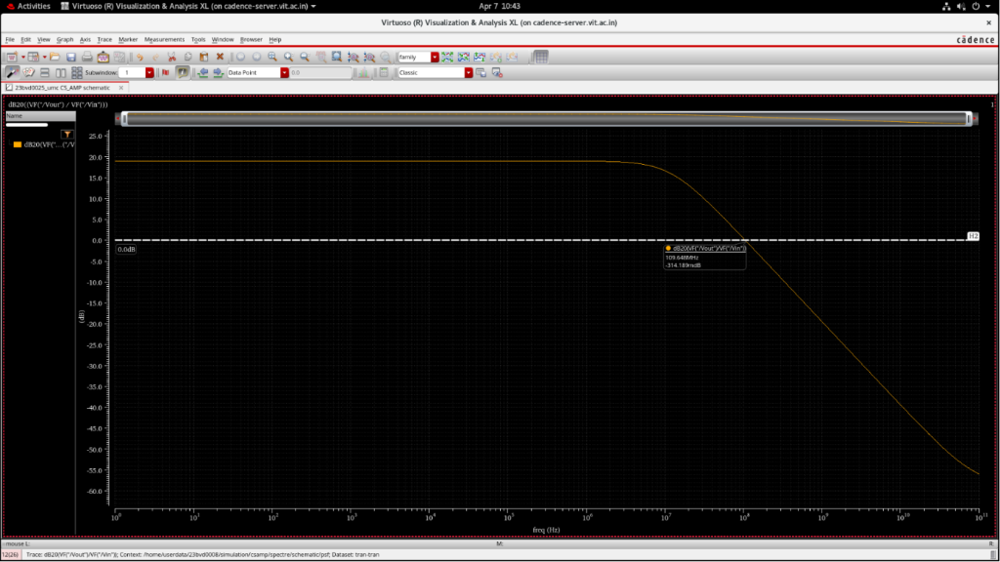

# Common Source Amplifier with Active Load

## Overview
This module details the design and implementation of a Common Source (CS) Amplifier utilizing a current mirror as an active load. Replacing a passive resistive load with an active PMOS current mirror significantly increases the voltage gain without excessively large voltage drops across the load.

### Design Specifications
- **Voltage Gain ($A_v$):** $\approx 4$ V/V
- **Unity Gain Bandwidth (GBW):** 100 MHz
- **Power Consumption:** 1 mW
- **Load Capacitance ($C_L$):** 5 pF
- **Supply Voltage ($V_{DD}$):** 1.8 V

---

## Schematic Design
The core amplifier uses an NMOS driver and a PMOS current mirror active load to establish high output impedance.

### Circuit Architecture

### Cadence Implementation

---

## Design Methodology & Sizing

### 1. Power Budget & Bias Current
Based on the power specification:
$$P = V_{DD} \times I_D$$
$$I_D = \frac{1 \text{ mW}}{1.8 \text{ V}} = 0.55 \text{ mA}$$

*(Note: Internal reference current for the mirror bias branch was modeled at $13.75\text{ \mu A}$)*

### 2. Transconductance ($g_m$) Requirement
Determined by the Unity Gain Bandwidth constraints:
$$g_m = 2\pi \cdot f_u \cdot C_L$$
$$g_m = 2\pi \times 100\text{MHz} \times 5\text{pF} = 3.14 \text{ mS}$$

### 3. Load Resistance ($R_L$) Calculation
$$A_v = g_m R_L$$
$$R_L = \frac{4}{0.5 \text{ mS}} = 4.6 \text{ k}\Omega$$

### 4. Transistor Sizing ($g_m/I_D$ Method)
Operating point efficiency:
$$\frac{g_m}{I_D} = \frac{0.5 \text{ mS}}{13.75 \text{ \mu A}} = 5.33$$

Current Density:
- $I_D/W = 25.17$
- Calculated Width ($W$): 42.23 $\mu$m

---

## Simulation & Validation Results

The CS amplifier with an active load was analyzed to confirm small-signal performance parameters.

### AC Response (Frequency & Gain)

### Validation Summary
The simulation confirms:
- The PMOS current mirror provides the required high-impedance active load.
- Target bandwidth and gain characteristics were achieved.
- Transistor operation stabilized under the 1 mW power constraint.
