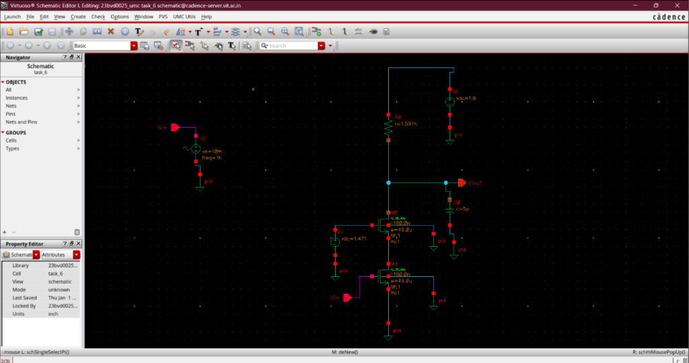

# Cascode Amplifier

## Overview
This module details the design and implementation of a Cascode Amplifier with a resistive load. The cascode architecture provides enhanced output impedance and significantly reduces the Miller effect, enabling higher bandwidth operation compared to a standard common-source stage.

### Design Specifications
- **Voltage Gain ($A_v$):** 20 dB (approx. 10 V/V)
- **Power Consumption:** 1 mW
- **3 dB Bandwidth ($f_{3dB}$):** 200 MHz
- **Load Capacitance ($C_L$):** 5 pF
- **Supply Voltage ($V_{DD}$):** 1.8 V

---

## Schematic Design
The amplifier employs a stacked transistor architecture (input driver $M_1$ and cascode device $M_0$) connected to a passive load resistor $R_D$.

### Circuit Architecture

### Cadence Implementation

---

## Design Methodology & Sizing

### 1. Power Budget & Bias Current
Based on the power specification:
$$P = I_D \times V_{DD}$$
$$I_D = \frac{1 \text{ mW}}{1.8 \text{ V}} = 0.555 \text{ mA}$$

### 2. Bandwidth & Load Resistance
The 3 dB bandwidth determines the output node resistance:
$$f_{3dB} = \frac{1}{2\pi R_D C_L}$$
$$R_D = \frac{1}{2\pi \times 5\text{pF} \times 200\text{MHz}} = 1.59 \text{ k}\Omega$$

### 3. Gain & Transconductance
Considering a design margin ($A_v = 12$):
$$A_v = g_m R_D$$
$$g_m = \frac{12}{1.59 \text{ k}\Omega} = 7.55 \text{ mS}$$

### 4. Transistor Sizing ($g_m/I_D$ Method)
Operating point efficiency:
$$\frac{g_m}{I_D} = \frac{7.55 \text{ mS}}{0.555 \text{ mA}} = 13.6$$

For the Cascode Transistor ($M_0$):
- Current Density ($I_D/W$): 13.1
- Required Width ($W$): 42.4 $\mu$m
- Bias Voltage ($V_{GS}$): 1.02 V

For the Input Driver ($M_1$):
- Bias Voltage ($V_{GS}$): $\approx 0.57$ V

**Methodology Plots:**

---

## Simulation & Validation Results

### Bias Point Verification
- Calculated $V_{bias} = 1.02 + 0.45 = 1.47\text{V}$
- $V_{in} = 0.57\text{V}$

### AC Analysis (Gain and Phase Response)
The amplifier's frequency behavior was analyzed to verify the gain and bandwidth constraints.

### Validation Summary
AC simulation results confirm:
- **Gain:** $\approx 18.97$ dB (Peak gain $\approx 19.855$ dB)
- **Bandwidth:** $\approx 25.19$ MHz
The design effectively achieves the targeted gain profile under the specified power constraints.
