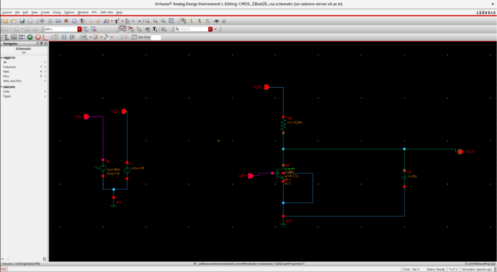
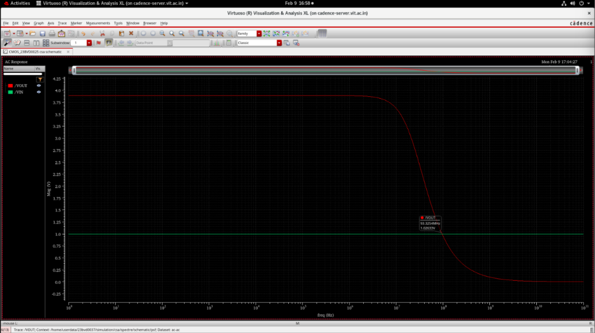
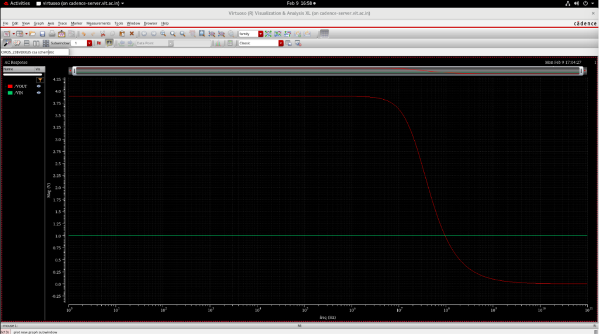
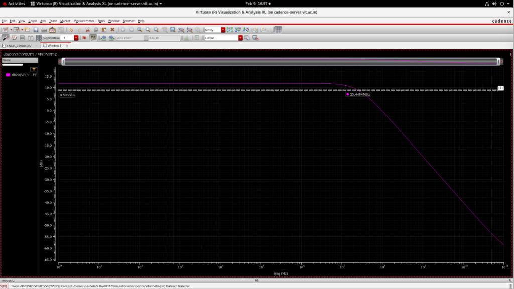

# Common Source Amplifier with Resistive Load

## Overview
This module details the design and implementation of a Common Source (CS) Amplifier utilizing a resistive load. The amplifier is designed to meet specific gain and bandwidth constraints, employing the $g_m/I_D$ methodology for precise transistor sizing.

### Design Specifications
- **Voltage Gain ($A_v$):** 4 V/V
- **Unity Gain Bandwidth (GBW):** 100 MHz
- **Load Capacitance ($C_L$):** 5 pF

---

## Schematic Design
The core amplifier uses an NMOS driving transistor with a passive resistor $R_L$ connected to $V_{DD}$.

### Circuit Architecture

### Cadence Implementation

---

## Design Methodology & Sizing

The transistor was sized according to the gain and bandwidth product specifications.

### 1. Transconductance ($g_m$) Requirement
The required transconductance is dictated by the Unity Gain Bandwidth (GBW):
$$GBW = \frac{g_m}{2\pi C_L}$$
$$g_m = GBW \times 2\pi \times C_L$$
$$g_m = (100 \times 10^6) \times (2\pi \times 5 \times 10^{-12}) = 3.14 \text{ mS}$$

### 2. Load Resistance ($R_L$) Calculation
The intrinsic voltage gain relates the transconductance to the output resistance:
$$A_v = -g_m R_o$$
$$4.8 = 3.14 \times 10^{-3} \times R_o \implies R_o = 1.528 \text{ k}\Omega$$

### 3. Bias Current ($I_D$)
$$I_D = \frac{V_{DD} - V_{OUT}}{R_o} = \frac{1.8 - 0.9}{1.528 \text{ k}\Omega} = 0.588 \text{ mA}$$

### 4. $g_m/I_D$ Methodology
The operating point efficiency:
$$\frac{g_m}{I_D} = \frac{3.14 \text{ mS}}{0.588 \text{ mA}} = 5.33$$

**$g_m/I_D$ Characteristic Curves:**

---

## Simulation & Validation Results

The designed amplifier was subjected to both AC and transient analysis to verify its performance metrics.

### AC Response (Frequency & Gain)
The frequency response validates the 3 dB bandwidth and the unity-gain crossover frequency.

### Output Characteristics

### Validation Summary
The CS amplifier successfully meets the design requirements:
- Targeted voltage gain of 4 V/V achieved.
- Unity gain bandwidth verified at 100 MHz.
- Device sizing methodology validated through simulation.
