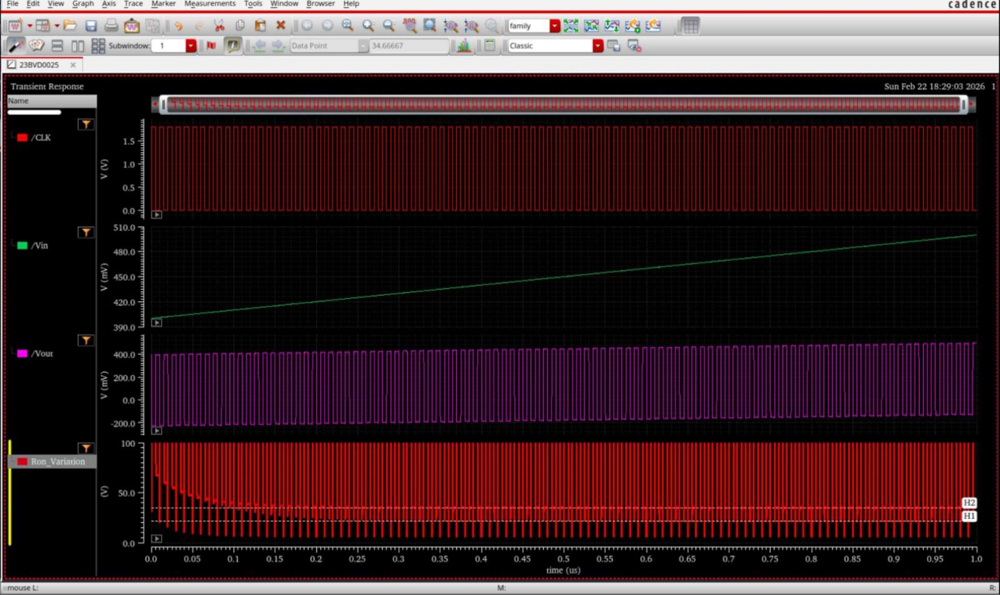

# Design Specifications vs. Achieved Results

This document presents a direct comparison between the initial target design specifications and the simulated performance metrics achieved by the transistor-level bootstrapped NMOS switch design:

---

## 1. Cadence Waveform & Result Summary
The screenshot below presents the transient locking waveforms alongside the final simulation results summary from Cadence:

---

## 2. Performance Comparison Table

| Performance Parameter | Target Specification | Achieved Result | Status |
|:---|:---|:---|:---|
| **Technology Node** | 180 nm CMOS | 180 nm CMOS | Passed |
| **Supply Voltage ($V_{DD}$)** | 1.8 V | 1.8 V | Passed |
| **Input Signal Sweep Range** | 1.0 Vpp (centered at 0.9 V) | 1.0 Vpp (centered at 0.9 V) | Passed |
| **Maximum Input Frequency ($f_{in}$)**| >= 10 MHz | 10 MHz | Passed |
| **Switch Device Configuration** | Bootstrapped NMOS | Bootstrapped NMOS | Passed |
| **On-Resistance Variation ($\Delta R_{on}$)** | <= +/- 5% | **+/- 3.43%** | Passed |
| **Total Harmonic Distortion (THD)** | <= -55 dB | **-75.996 dB** | Passed |

All performance targets were comfortably exceeded, confirming that the design meets and surpasses all sign-off specifications.
