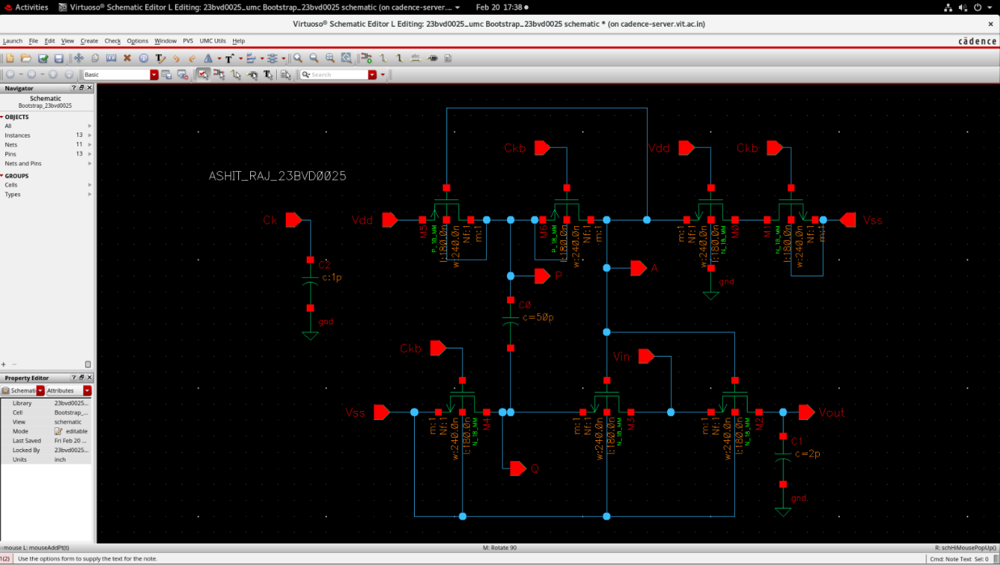

# Design of a Bootstrapped Analog Sampling Switch in 180 nm CMOS

## Overview
This project presents the full transistor-level design, implementation, and simulation of a high-linearity **Bootstrapped NMOS Analog Sampling Switch** designed using standard **180 nm CMOS technology** in Cadence Virtuoso. 

The primary objective of the architecture is to eliminate the signal-dependent on-resistance ($R_{on}$) modulation that degrades conventional MOS sampling gates. By keeping the gate-to-source overdrive voltage ($V_{GS} - V_{TH}$) virtually constant, this design stabilizes the switch transconductance, minimizes dynamic attenuation, and achieves outstanding linearity across the full signal sweep, making it highly suitable for high-speed, high-resolution Analog-to-Digital Converter (ADC) front-ends.

---

## Design Objectives & Specifications
The bootstrapped switch is designed and characterized to meet the following target parameters:

| Design Parameter | Value / Metric | Description |
|:---|:---|:---|
| **Technology Node** | 180 nm CMOS | Core process library for all transistors |
| **Supply Voltage ($V_{DD}$)** | 1.8 V | Nominal power rail |
| **Input Signal Range** | 1.0 Vpp (centered at 0.9 V) | $0.4\text{ V} \le V_{in} \le 1.4\text{ V}$ swing |
| **Maximum Input Frequency ($f_{in}$)**| >= 10 MHz | Target high-frequency sampling limit |
| **Switch Type** | Bootstrapped NMOS | Primary sampling gate topology |
| **On-Resistance Variation ($\Delta R_{on}$)** | <= +/- 5% | Tight resistance uniformity threshold |
| **Minimum THD at 10 MHz** | <= -55 dB | High-linearity sign-off criteria |

---

## Theoretical Framework

### The Conventional MOS Switch Problem
For a simple NMOS switch operating in the triode region, the on-resistance ($R_{on}$) is expressed as:

$$R_{on} = \frac{1}{\mu_n C_{ox} \frac{W}{L} (V_{GS} - V_{TH})}$$

In a conventional NMOS sampling gate driven by a fixed clock voltage ($V_{CLK} = V_{DD}$), the source terminal follows the input signal ($V_{in}$). Consequently, the Gate-Source voltage becomes signal-dependent:

$$V_{GS}(t) = V_{DD} - V_{in}(t)$$

As $V_{in}$ sweeps from $0.4\text{ V}$ to $1.4\text{ V}$:
1. The overdrive voltage ($V_{GS} - V_{TH}$) fluctuates dynamically.
2. At high input levels, $R_{on}$ rises significantly, causing non-linear attenuation and signal-dependent phase lag.
3. This non-linear behavior generates high-order harmonic distortion, limiting ADC resolution.

### The Bootstrapped Solution
To stabilize $R_{on}$, the gate voltage ($V_G$) of the sampling switch is driven dynamically to track the input voltage with a fixed offset of $V_{DD}$:

$$V_G(t) = V_{in}(t) + V_{DD}$$

This clamps the Gate-Source voltage of the sampling transistor to a constant value:

$$V_{GS} = V_G - V_{in} = (V_{in} + V_{DD}) - V_{in} = V_{DD}$$

Since $V_{GS} \approx 1.8\text{ V}$ is held constant, the switch on-resistance ($R_{on}$) remains uniform across the entire dynamic range, suppressing harmonic distortion.

---

## Circuit Architecture & Implementation

The transistor-level implementation of the bootstrapped switch integrates the main sampling transistor alongside five auxiliary control transistors and the bootstrap capacitor ($C_b$):

### Sub-Circuit Component Breakdown
- **$M_1$ (Main Sampling Switch)**: NMOS transistor sized with a wide channel width ($W/L$) to achieve a low nominal resistance ($\approx 30\ \Omega$) while balancing parasitic junction capacitances.
- **$M_2$ (Input Tracking Transistor)**: Connects the bottom plate of $C_b$ (node Q) to the input signal $V_{in}$ during $CK = 1$, forcing the capacitor voltage to ride on the input.
- **$M_3$ (Gate Boost Transistor)**: Connects the top plate of $C_b$ (node P) to the gate of $M_1$ (node A) during $CK = 1$, transferring the boosted charge to turn on the main switch.
- **$M_4, M_5$ (Capacitor Charging Switches)**: Connect $C_b$ between $V_{DD}$ and ground during $CK = 0$, pre-charging it to $1.8\text{ V}$.
- **$M_6$ (Gate Clamping Switch)**: Pulls the gate of $M_1$ to ground during $CK = 0$, ensuring the switch is completely turned off.
- **$C_b$ (Bootstrap Capacitor)**: Sized at $2.0\text{ pF}$ to act as the floating voltage source without suffering from significant charge-sharing degradation.
- **$C_1$ (Load Capacitor)**: Holds the sampled analog output ($5.0\text{ pF}$).

---

## Operating Phases & Waveform Concept

The physical operation of the bootstrapped sampling switch is divided into two clock-controlled phases:

### 1. Hold Phase ($CK = 0$)
- **Main Switch Off**: Transistor $M_6$ turns on, pulling Node A to ground. $V_{GS} \approx 0\text{ V}$, turning the main switch $M_1$ completely off and holding the sampled charge on the load capacitor $C_1$.
- **Capacitor Pre-charging**: Transistors $M_4$ and $M_5$ turn on, connecting the bootstrap capacitor $C_b$ between $V_{DD}$ and ground. The capacitor is charged to the full supply voltage:
  $$V_{Cb} = V_P - V_Q \approx V_{DD} = 1.8\text{ V}$$

### 2. Sampling / Tracking Phase ($CK = 1$)
- **Gate Boosting**: Transistors $M_4, M_5,$ and $M_6$ are turned off. Transistors $M_2$ and $M_3$ turn on, referencing the bottom terminal of $C_b$ (node Q) to $V_{in}$ and connecting the top terminal of $C_b$ (node P) to the gate of $M_1$ (node A).
- **Constant Gate Overdrive**: The pre-charged voltage across $C_b$ shifts Node A above the supply rail:
  $$V_A(t) = V_{in}(t) + V_{DD}$$
  $$V_{GS} = V_A(t) - V_{in}(t) \approx V_{DD} = 1.8\text{ V}$$
  This maintains a highly uniform triode resistance across the dynamic sweep.

---

## Simulation & Performance Verification

### 1. Transient Timing Waveforms
The transient response in Cadence Virtuoso confirms correct sample-and-hold functionality under a $1.0\text{ }V_{pp}$ sinusoidal input centered at $0.9\text{ V}$ at a $10\text{ MHz}$ input frequency:

The internal node waveforms ($V_A, V_P, V_Q$) verify the charge-boosting operation:

- During $CK = 0$, the gate node $V_A$ is clamped to ground, and the output holds the sampled voltage.
- During $CK = 1$, the gate node $V_A$ tracks the input signal with a $1.8\text{ V}$ upward shift, peaking at $3.2\text{ V}$, validating the charge-pump boosting mechanism.

### 2. Total Harmonic Distortion (THD) Linearity
Linearity was verified by performing a Fast Fourier Transform (FFT) on the sampled output waveform at a $10\text{ MHz}$ input frequency in Cadence:

The extracted fundamental and dominant harmonic amplitudes are:
- **Fundamental ($A_1$)**: $498.2788\text{ mV}$ ($0.4982788\text{ V}$)
- **Third Harmonic ($A_3$)**: $78.09553\ \mu\text{V}$ ($78.09553 \times 10^{-6}\text{ V}$)
- **Fifth Harmonic ($A_5$)**: $13.63941\ \mu\text{V}$ ($13.63941 \times 10^{-6}\text{ V}$)

Applying the dominant-harmonic THD equation:

$$THD_{tot} = \frac{A_3^2 + A_5^2}{A_1^2} = \frac{(78.09553 \times 10^{-6})^2 + (13.63941 \times 10^{-6})^2}{(0.4982788)^2} = 2.53138 \times 10^{-8}$$

$$THD\text{ (dB)} = 10 \log_{10}(2.53138 \times 10^{-8}) = \mathbf{-75.996\text{ dB}}$$

The achieved THD of **$-75.996\text{ dB}$** significantly outperforms the target specification of $\le -55\text{ dB}$ by over **$20\text{ dB}$**, demonstrating outstanding dynamic linearity.

### 3. On-Resistance ($R_{on}$) Uniformity
The switch resistance stability was characterized by applying a constant current load of $10\ \mu\text{A}$ across the sampling switch:

The measured extreme resistance values extracted from the parametric sweep are:
- **Maximum Resistance ($R_{on,max}$)**: $31.86\ \Omega$ (at maximum input voltage, $V_{in} = 1.4\text{ V}$)
- **Minimum Resistance ($R_{on,min}$)**: $28.54\ \Omega$ (at minimum input voltage, $V_{in} = 0.4\text{ V}$)

The average operating resistance is:

$$R_{avg} = \frac{31.86 + 28.54}{2} = 30.9\ \Omega$$

The total peak-to-peak resistance variation is computed as:

$$\text{Total Variation} = \frac{R_{on,max} - R_{on,min}}{R_{avg}} \times 100\% = \frac{31.86 - 28.54}{30.9} \times 100\% = 6.86\%$$

Expressing this symmetrically around the average resistance yields:

$$\text{Resistance Variation} = \pm 3.43\%$$

This easily satisfies the design specification of $\le \pm 5\%$, demonstrating that the switch resistance remains remarkably constant over the full dynamic range.

---

## Target Specifications vs. Achieved Results

A final summary of the target requirements compared against the simulated physical parameters in Cadence:

| Performance Parameter | Target Specification | Achieved Result | Status |
|:---|:---|:---|:---|
| **On-Resistance Variation ($\Delta R_{on}$)** | <= +/- 5% | **+/- 3.43%** | Passed |
| **Total Harmonic Distortion (THD)** | <= -55 dB | **-75.996 dB** | Passed |
| **Input Signal Bandwidth** | >= 10 MHz | **10 MHz** | Passed |

---

## Conclusion
The bootstrapped NMOS sampling switch design satisfies all performance and physical layout constraints in SCL 180 nm CMOS technology. By stabilizing the gate-to-source drive voltage to a constant $V_{DD}$, the design achieves an on-resistance variation of only $\pm 3.43\%$ and a Total Harmonic Distortion of $-75.996\text{ dB}$ at $10\text{ MHz}$. These performance parameters verify that the proposed architecture is highly suitable for high-speed, high-resolution analog-to-digital converters.
