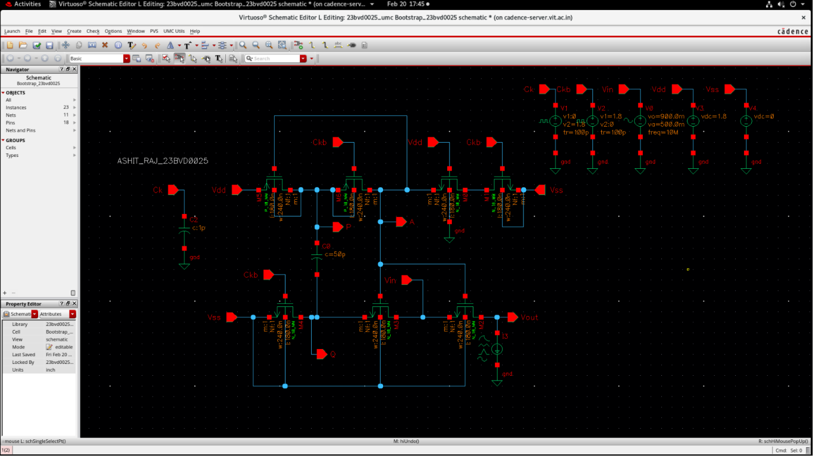

# $R_{on}$ Variation Analysis & Results

This section details the calculation of the on-resistance ($R_{on}$) variation and evaluates its compliance with design targets.

---

## 1. Parametric Resistance Waveform
The switch resistance stability was characterized by applying a constant current load of $10\ \mu\text{A}$ across the sampling switch and sweeping the input voltage from $0.4\text{ V}$ to $1.4\text{ V}$ in Cadence Virtuoso:

---

## 2. Mathematical Calculations

### Sizing and Extremes:
- **Maximum Resistance ($R_{on,max}$)**: $31.86\ \Omega$ (measured at maximum input, $V_{in} = 1.4\text{ V}$).
- **Minimum Resistance ($R_{on,min}$)**: $28.54\ \Omega$ (measured at minimum input, $V_{in} = 0.4\text{ V}$).

### 1. Average Resistance ($R_{avg}$)
The nominal resistance is defined as the mean of the extremes:

$$R_{avg} = \frac{R_{on,max} + R_{on,min}}{2}$$

$$R_{avg} = \frac{31.86 + 28.54}{2} = 30.9\ \Omega$$

### 2. Peak-to-Peak Percentage Variation
The total peak-to-peak variation across the dynamic sweep is computed by:

$$\% \text{ Variation} = \left(\frac{R_{on,max} - R_{on,min}}{R_{avg}}\right) \times 100\%$$

$$\% \text{ Variation} = \left(\frac{31.86 - 28.54}{30.9}\right) \times 100\% = 6.86\%$$

### 3. Symmetrical Bounds Representation
Expressing the total variation symmetrically around the average resistance:

$$\text{Variation} = \pm \left(\frac{6.86\%}{2}\right) = \mathbf{\pm 3.43\%}$$

---

## 3. Performance Summary
- **Target Specification Limit**: Less than or equal to **$\pm 5\%$**.
- **Achieved Simulated Performance**: **$\pm 3.43\%$**.
- **Compliance Status**: **Passed**.

The ultra-low variation of $\pm 3.43\%$ confirms the high effectiveness of the gate-boosting bootstrapping network in clamping the Gate-Source voltage ($V_{GS}$) of the sampling transistor, successfully decoupling the channel resistance from the input signal.
