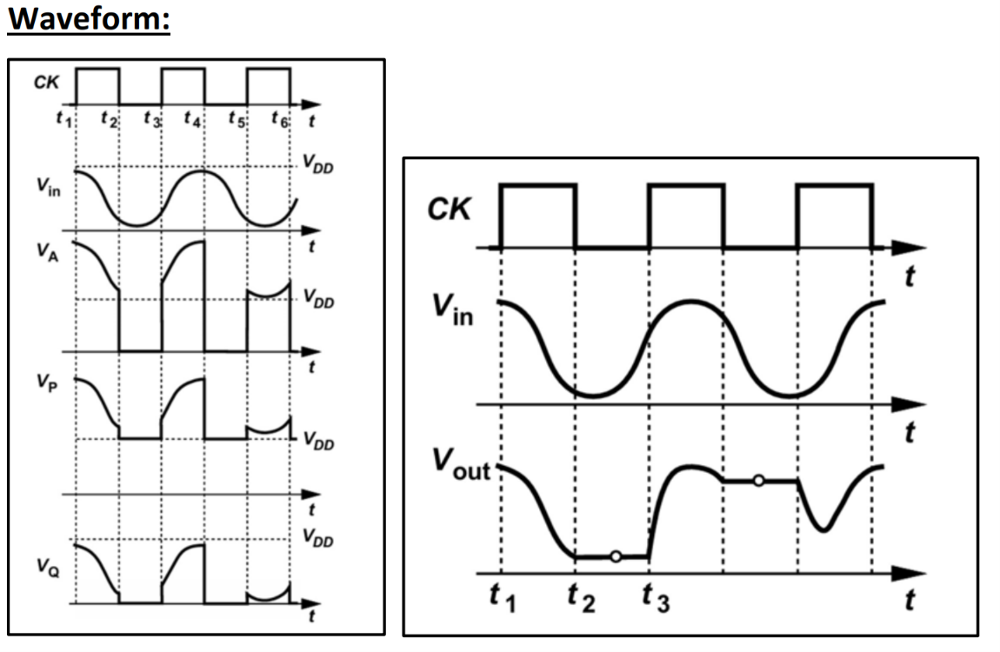
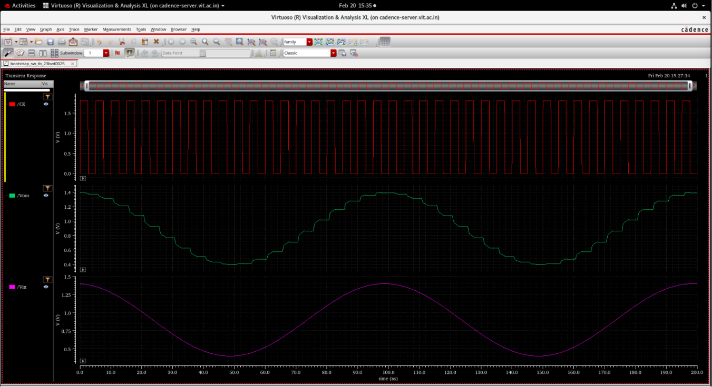

# Waveform Analysis & Simulation Outputs

This section analyzes the simulated time-domain waveforms of the bootstrapped switch obtained from transient analysis in Cadence Virtuoso.

---

## 1. Conceptual Ideal Waveforms
The conceptual timing diagram below illustrates the ideal relationship between the sampling clock ($CK$), the sinusoidal input ($V_{in}$), the internal nodes ($V_A, V_P, V_Q$), and the sampled output ($V_{out}$):

---

## 2. Simulated Sample-and-Hold Performance
The transient simulation in Cadence Virtuoso verifies correct sample-and-hold operation under a $1.0\text{ }V_{pp}$ sinusoidal input ($10\text{ MHz}$) centered at $0.9\text{ V}$:

### Key Observations:
- **Tracking Phase ($CK = 1$)**: The output voltage ($V_{out}$) tracks the $1.0\text{ }V_{pp}$ input signal with negligible settling delay and zero phase distortion.
- **Hold Phase ($CK = 0$)**: The output voltage ($V_{out}$) holds the sampled voltage on the load capacitor ($C_1$), appearing as a flat horizontal line until the next clock cycle. This confirms correct hold functionality.

---

## 3. Simulated Internal Node Charging & Boosting Waveforms
The waveforms of the internal nodes ($V_A, V_P, V_Q$) verify the charge-boosting operation of the bootstrap capacitor network:

### Sizing and Operation Verification:
- **Bottom Plate $V_Q$**: Clamped to $0\text{ V}$ during $CK = 0$. Connected directly to the input signal during $CK = 1$, allowing the capacitor to "ride" on $V_{in}$.
- **Top Plate $V_P$**: Charged to $1.8\text{ V}$ ($V_{DD}$) during $CK = 0$. Boosted to $V_{in} + V_{DD}$ (up to $2.7\text{ V} - 3.2\text{ V}$) during $CK = 1$.
- **Gate Node $V_A$**: Follows Node P during the tracking phase ($CK = 1$) and is clamped to ground during the hold phase ($CK = 0$). This ensures the Gate-Source overdrive remains clamped exactly to $V_{DD}$ without suffering from dynamic charge sharing or routing decay.
