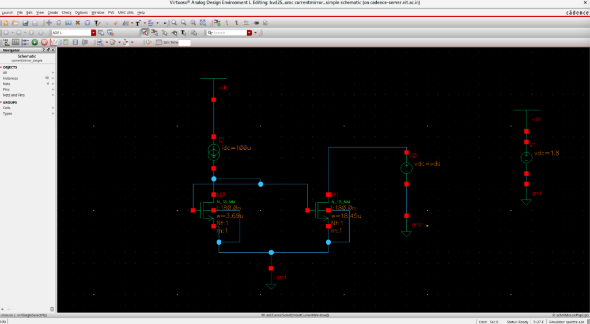
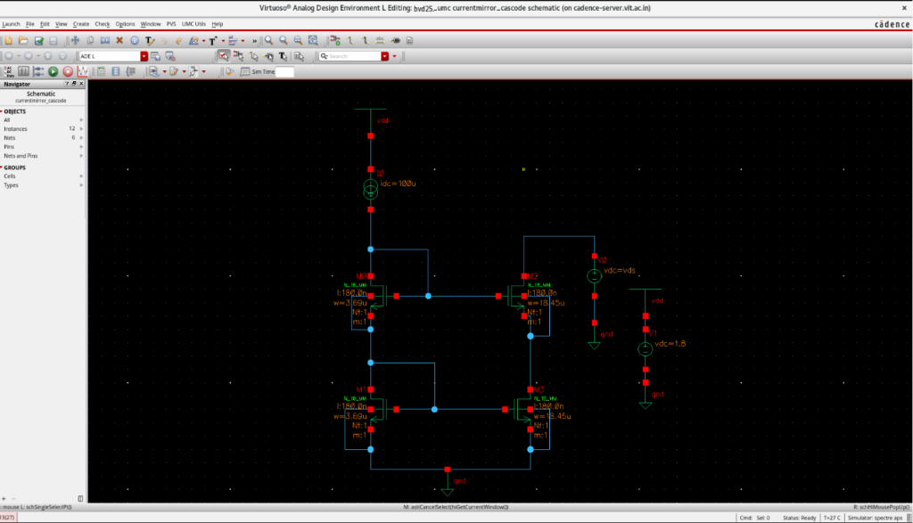
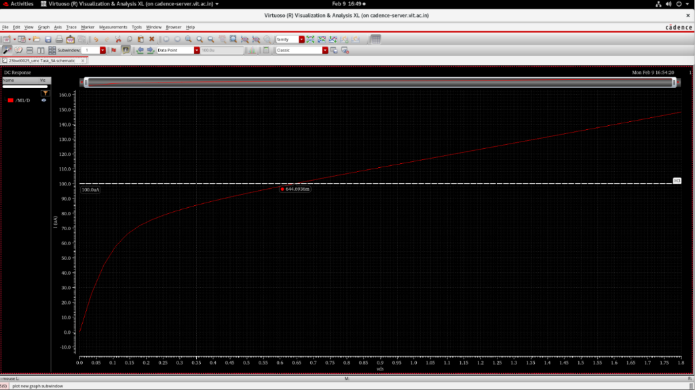
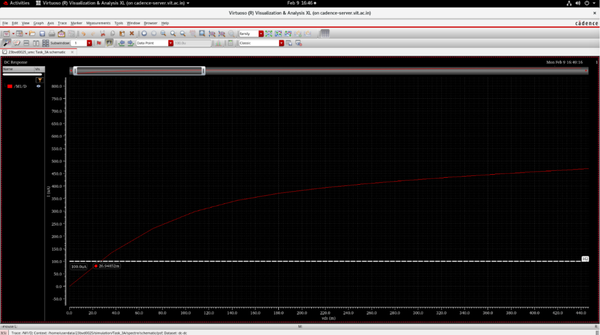
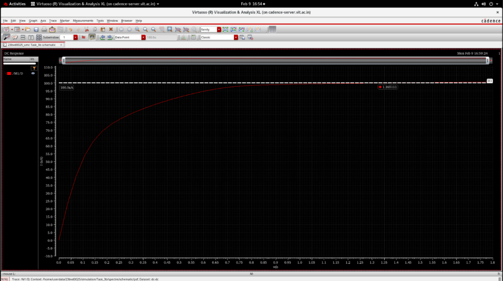
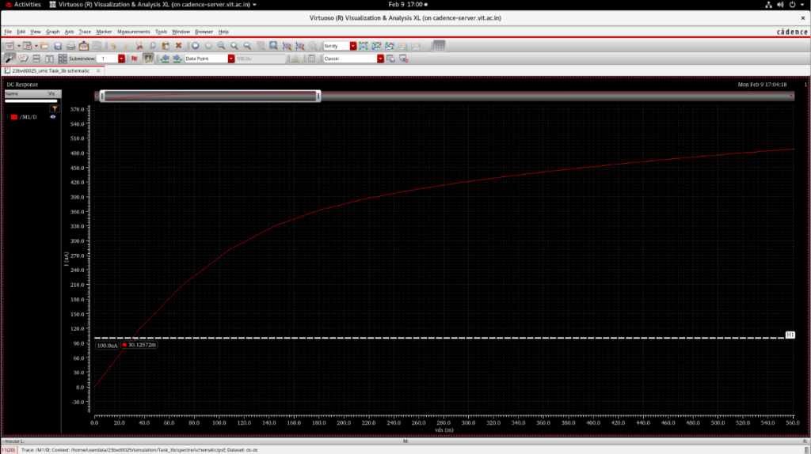

# CMOS Current Mirrors

## Overview
This module covers the design and implementation of current mirror circuits using the $g_m/I_D$ methodology. Current mirrors are fundamental building blocks in analog IC design, providing stable bias currents and acting as active loads. Both Simple and Cascode current mirror topologies are explored.

### Design Specifications
- **Reference Current ($I_{ref}$):** 100 $\mu$A
- **Output Current 1 ($I_{out}$):** 100 $\mu$A
- **Output Current 2 ($I_{out}$):** 500 $\mu$A
- **Target Output Voltage ($V_{out}$):** 200 mV

---

## Schematic Design

### Simple Current Mirror
A standard two-transistor topology offering basic current replication.

### Cascode Current Mirror
A four-transistor topology designed to increase output resistance and improve current matching over a wider voltage range.

---

## Design Methodology & Sizing

The mirrors were designed using the robust $g_m/I_D$ methodology for precise control over the region of operation.

### MOSFET Characterization
$$g_m = \frac{2I_D}{V_{GS} - V_T}$$
For $I_D = 100 \text{ \mu A}$ and $V_{ov} = 200 \text{ mV}$:
$$g_m = \frac{2 \times 100 \text{ \mu A}}{200 \text{ mV}} = 1 \text{ mS}$$

### $g_m/I_D$ Evaluation
$$\frac{g_m}{I_D} = \frac{1 \text{ mS}}{100 \text{ \mu A}} = 10$$

### Device Sizing
From the $g_m/I_D$ characterization charts:
At $g_m/I_D = 10$:
- $V_{GS} = 589.018 \text{ mV}$
- Current Density ($I_D/W$) = 27.0404 $\mu$A/$\mu$m

**Width Calculation:**
$$W = \frac{I_D}{I_D/W} = \frac{100}{27.0404} = 3.69 \text{ \mu m}$$

---

## Simulation & Validation Results

### Simple Current Mirror Characteristics
**100 $\mu$A Output Verification:**

**500 $\mu$A Output Verification:**

### Cascode Current Mirror Characteristics
The cascode structure visually demonstrates higher output resistance (flatter $I_D-V_{DS}$ curves) compared to the simple mirror.

**100 $\mu$A Output Verification:**

**500 $\mu$A Output Verification:**

### Validation Summary
- Reference currents were accurately mirrored.
- Proper device sizing was verified via simulation.
- The Cascode mirror successfully demonstrated improved output impedance relative to the simple mirror.
