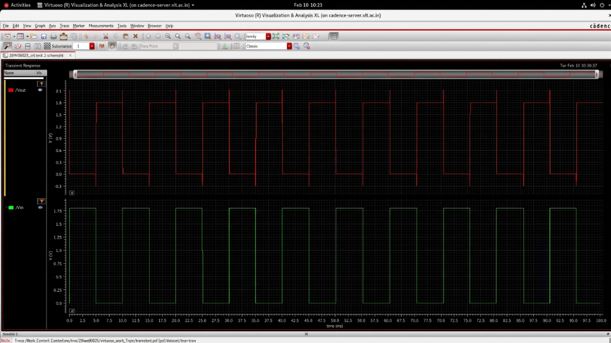

# Custom High-Speed CMOS D-Flip-Flop (DFF)

## Overview
The **D-Flip-Flop (DFF)** is a high-speed, edge-triggered sequential logic standard cell designed and verified using standard **180 nm CMOS technology** in Cadence Virtuoso. 

This edge-triggered flip-flop serves as a foundational building block for two critical digital blocks in the Phase-Locked Loop (PLL) design:
1. **Phase Frequency Detector (PFD)**: Dual DFFs with an external NAND reset path are utilized to detect phase and frequency differences between the reference clock ($f_{ref}$) and feedforward feedback signal ($f_{fb}$).
2. **Divide-by-128 Counter**: Seven cascaded D-Flip-Flops configured as toggle dividers implement the asynchronous dividing chain that down-converts the $2.56\text{ GHz}$ Voltage-Controlled Oscillator (VCO) frequency back to the $20\text{ MHz}$ reference clock domain.

---

## Transistor-Level Circuit Schematic
The full master-slave transistor-level schematic capture of the D-Flip-Flop cell in Cadence Virtuoso:

---

## Circuit Architecture & Master-Slave Design
The D-Flip-Flop is designed using a high-reliability **Master-Slave NAND-Gate Configuration** to prevent clock-overlap race conditions and guarantee stable edge-triggered operation:

### 1. Circuit Features
- **Master Stage**: Captures the state of the input `D` when the clock (`CLK`) is in a low state (`0`).
- **Slave Stage**: Transfers the captured Master state to the outputs `Q` and `Q-` when the clock (`CLK`) transitions to a high state (`1`).
- **Feedback Loops**: Built-in cross-coupled latch networks inside both the Master and Slave stages maintain the stored logic state indefinitely without relying on charge storage on parasitic nodes, preventing leakage-induced logic failures.
- **NAND Logic Gates**: Fully constructed utilizing custom-tailored two-input NAND gates (**NAND2**) and three-input NAND gates (**NAND3**).

### 2. Physical Layout Constraints
- **Height Matching**: Standardized vertical boundaries match the cell row height of the entire custom standard cell library.
- **Symmetric Sizing**: Aspect ratios for the logic blocks are optimized to minimize the internal clock-to-Q propagation delay and maximize hold time margins.

---

## Timing Characteristics

| Clock Event (CLK) | Input D | Master State | Output Q | Output Q- | Operation |
|:---:|:---:|:---:|:---:|:---:|:---:|
| **CLK = 0** | **X** (Don't care) | Latches input `D` | Retains old state | Retains old state | Hold Output / Sample Input |
| **Rising Edge ($\uparrow$)** | **0** | **0** | **0** | **1** | Write Logic '0' to Output |
| **Rising Edge ($\uparrow$)** | **1** | **1** | **1** | **0** | Write Logic '1' to Output |
| **CLK = 1** | **X** (Don't care) | Isolated | Retains output | Retains output | Hold Output |

---

## Physical Verification Summary
1. **Calibre DRC (Design Rule Checking)**: Fully clean layout routing boundaries.
2. **Calibre LVS (Layout Versus Schematic)**: 100% netlist matching between the schematic logic gates and the physical layout.
