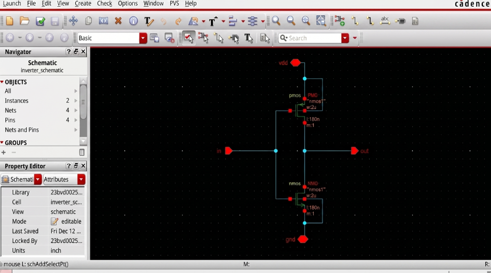
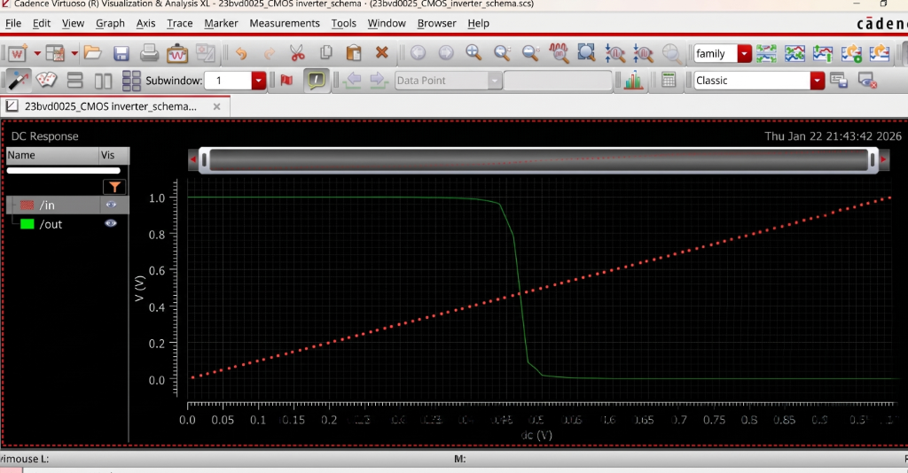
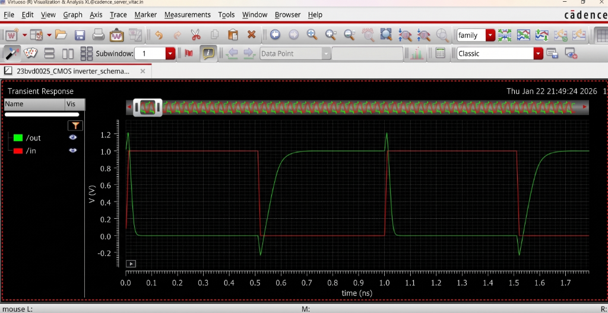
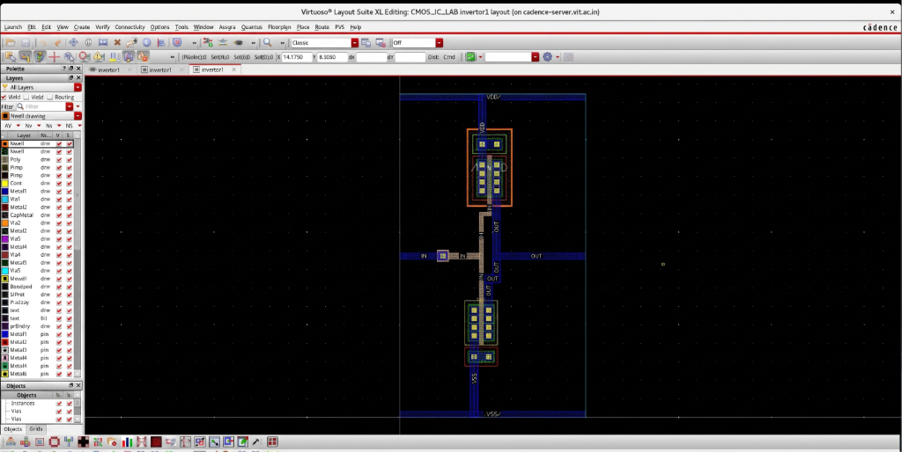
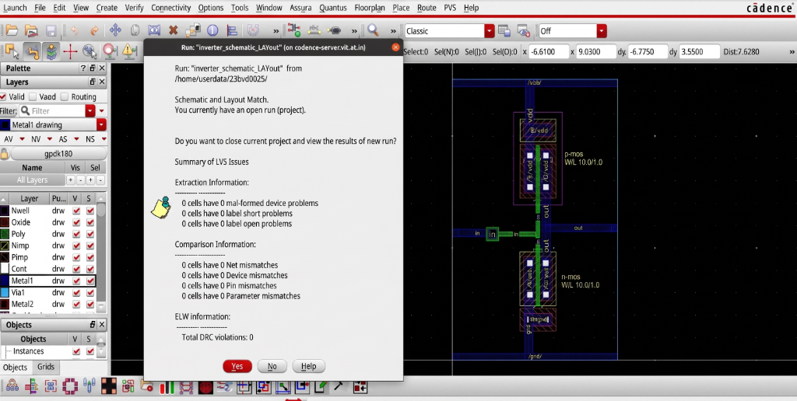
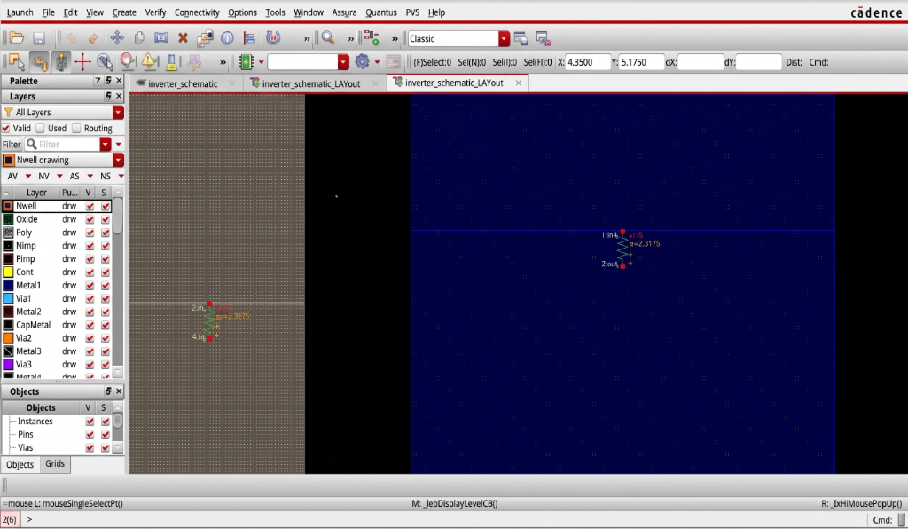
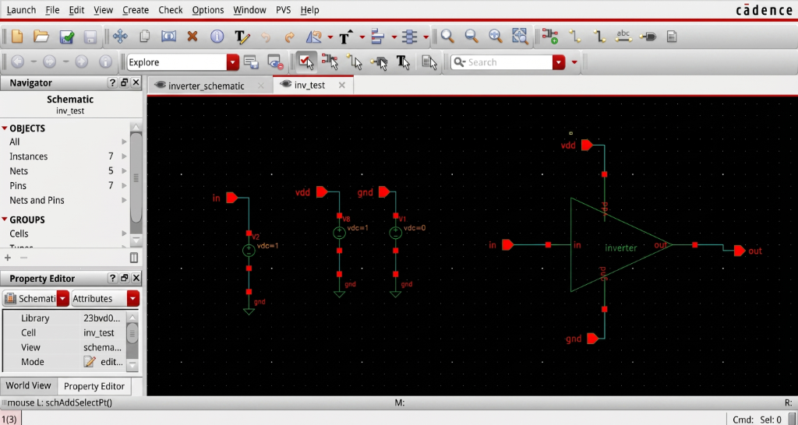
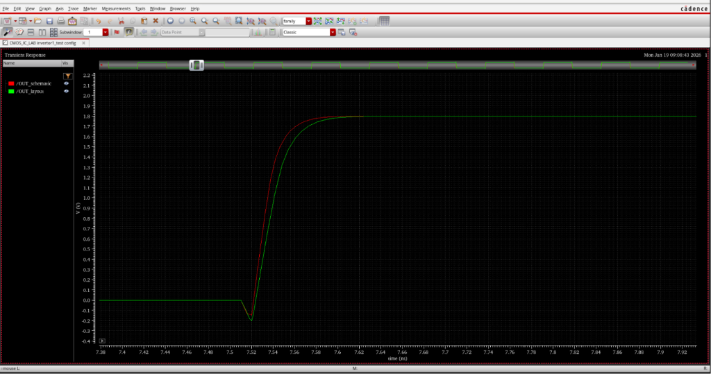

# CMOS Inverter Design & Characterization

## Overview
This module details the design, implementation, and characterization of a standard CMOS Inverter cell. The characterization covers both pre-layout and post-layout simulations to analyze the impact of physical parasitic elements on the switching performance.

### Key Analysis Metrics
- DC Voltage Transfer Characteristics (VTC)
- Transient Response
- Propagation Delay Evaluation
- Layout Versus Schematic (LVS) Verification
- RC Parasitic Extraction (RCX)

---

## Schematic Design
The core inverter logic is realized using standard complementary PMOS and NMOS devices.

### Circuit Diagram

### Symbol Generation

### Cadence Implementation

---

## Pre-Layout Simulation & Analysis

### DC Characteristics (Voltage Transfer Curve)
The DC sweep analyzes the transition region between logic levels.

### Transient Response
The transient analysis verifies the time-domain switching behavior for a standard square pulse input.

### Pre-Layout Propagation Delay Calculation
Based on the transient response waveforms:
- **High-to-Low Delay ($t_{PHL}$):** 0.049491 ns
- **Low-to-High Delay ($t_{PLH}$):** 0.017743 ns

**Average Propagation Delay ($t_{pd1}$):**
$$t_{pd1} = \frac{t_{PHL} + t_{PLH}}{2} = 33.67 \text{ ps}$$

---

## Physical Design & Verification

### Inverter Layout
The physical layout involves optimal placement and routing of the PMOS and NMOS devices, minimizing internal capacitances and resistances.

### Verification
The layout successfully passed Design Rule Checks (DRC) and Layout Versus Schematic (LVS) comparisons.

### Parasitic Extraction
RC extraction was performed to model the physical interconnect parasitics accurately.

---

## Post-Layout Simulation & Validation

### ADE Testbench Configuration

### Layout vs Schematic Comparison
The extracted layout netlist was simulated and overlaid with the schematic response.

**Rising Transition Comparison:**

**Falling Transition Comparison:**

### Post-Layout Propagation Delay Calculation
Based on the extracted layout waveform:
- **High-to-Low Delay ($t_{PHL}$):** 0.057466 ns
- **Low-to-High Delay ($t_{PLH}$):** 0.02043 ns

**Average Propagation Delay ($t_{pd2}$):**
$$t_{pd2} = \frac{t_{PHL} + t_{PLH}}{2} = 38.948 \text{ ps}$$

---

## Validation Results

The post-layout propagation delay is observed to be higher than the pre-layout delay due to the physical layout introducing additional parasitic resistance and capacitance.

**Percentage Increase in Delay:**
$$\% \text{Increase} = \frac{t_{pd2} - t_{pd1}}{t_{pd1}} \times 100 = 15.67\%$$

**Impact Analysis:**
- Increased RC time constant
- Marginal reduction in switching speed
- Increase in overall propagation delay

The standard cell meets the required logic operation criteria and is validated for top-level integration.
