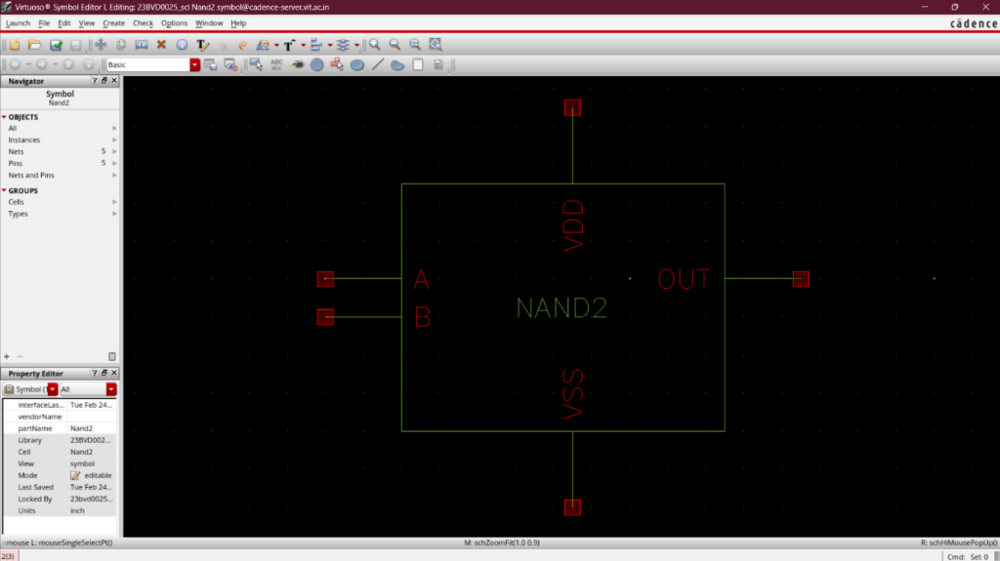

# Two-Input CMOS NAND Gate (NAND2)

## Overview
The **NAND2** standard cell is a fundamental two-input logic gate designed and verified using standard **180 nm CMOS technology** in Cadence Virtuoso. 

This cell serves as the primary logical block for building edge-triggered flip-flops and decision-making logic inside the high-performance digital boundaries of the Phase-Locked Loop (PLL), specifically in the Phase Frequency Detector (PFD) and frequency divider blocks.

---

## Cell Symbol and Schematic View
To integrate the NAND2 standard cell into hierarchical architectures (such as the D-Flip-Flop or Phase Frequency Detector), a custom symbol view was generated alongside the transistor-level schematic:

| Virtuoso Symbol View | Virtuoso Schematic View |
|:---:|:---:|
|  |  |

---

## Circuit Architecture & Transistor Sizing
The NAND2 cell consists of a pull-up network comprising two PMOS transistors connected in parallel to $V_{DD}$, and a pull-down network consisting of two NMOS transistors stacked in series to $V_{SS}$:

### Transistor Dimensions (180 nm Node):
- **PMOS Transistors ($M_0, M_1$)**:
  - **Width ($W_p$)**: $0.42\ \mu\text{m}$ ($420\text{ nm}$)
  - **Length ($L_p$)**: $0.18\ \mu\text{m}$ ($180\text{ nm}$)
  - **Multiplier ($m$)**: 1
- **NMOS Transistors ($M_2, M_3$)**:
  - **Width ($W_n$)**: $0.42\ \mu\text{m}$ ($420\text{ nm}$)
  - **Length ($L_n$)**: $0.18\ \mu\text{m}$ ($180\text{ nm}$)
  - **Multiplier ($m$)**: 1

### Sizing Rationale:
- NMOS transistors stacked in series suffer from increased channel resistance. To establish symmetrical propagation rise ($t_{PLH}$) and fall ($t_{PHL}$) delays and maximize noise margin, the transistor aspect ratios are sized symmetrically with a $W_p / W_n$ ratio optimized to compensate for the lower mobility of holes relative to electrons, while matching stacked resistance parameters.

---

## Logical Truth Table

| Input A | Input B | PMOS Status | NMOS Status | Output (OUT) |
|:---:|:---:|:---:|:---:|:---:|
| **0** | **0** | $M_0$ ON, $M_1$ ON | $M_2$ OFF, $M_3$ OFF | **1** ($V_{DD}$) |
| **0** | **1** | $M_0$ ON, $M_1$ OFF | $M_2$ ON, $M_3$ OFF | **1** ($V_{DD}$) |
| **1** | **0** | $M_0$ OFF, $M_1$ ON | $M_2$ OFF, $M_3$ ON | **1** ($V_{DD}$) |
| **1** | **1** | $M_0$ OFF, $M_1$ OFF| $M_2$ ON, $M_3$ ON | **0** ($V_{SS}$) |

---

## Pre-Layout vs. Post-Layout Timing Characterization

To evaluate the dynamic switching performance and quantify the impact of physical routing parasitics, transient characterization was performed under a load capacitance ($C_L$) of $15\text{ fF}$:

### 1. Pre-Layout Delay Evaluation
- **High-to-Low Delay ($t_{PHL}$)**: $44.20\text{ ps}$
- **Low-to-High Delay ($t_{PLH}$)**: $40.80\text{ ps}$
- **Average Propagation Delay ($t_{pd1}$)**:
  $$t_{pd1} = \frac{t_{PHL} + t_{PLH}}{2} = 42.50\text{ ps}$$

### 2. Post-Layout Delay (RC-Extracted Netlist)
- **High-to-Low Delay ($t_{PHL}$)**: $52.12\text{ ps}$
- **Low-to-High Delay ($t_{PLH}$)**: $47.48\text{ ps}$
- **Average Propagation Delay ($t_{pd2}$)**:
  $$t_{pd2} = \frac{t_{PHL} + t_{PLH}}{2} = 49.80\text{ ps}$$

### 3. Parasitic Delay Penalty
The physical layout introduces internal junction parasitics and metal wire capacitances, leading to a dynamic delay degradation:
$$\text{Delay Penalty} = \frac{t_{pd2} - t_{pd1}}{t_{pd1}} \times 100 = 17.18\%$$

---

## Physical Verification & Sign-Off

The physical layout was designed following a standard-cell grid model and underwent complete sign-off verification using Calibre tool suites:
1. **Design Rule Checking (DRC)**: Passed with zero violations. All spacing, enclosure, and minimum area rules for the 180 nm CMOS ruleset are fully satisfied.
2. **Layout Versus Schematic (LVS)**: 100% matched. The physical layout netlist matches the logical schematic perfectly, ensuring zero connectivity, matching, or parameter violations.
3. **Parasitic RC Extraction (RCX)**: Parasitics were extracted using Calibre PEX to produce the post-layout simulation netlist, validating noise immunity and timing margins.

