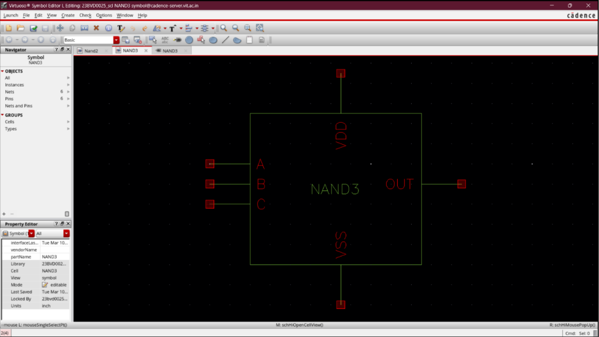
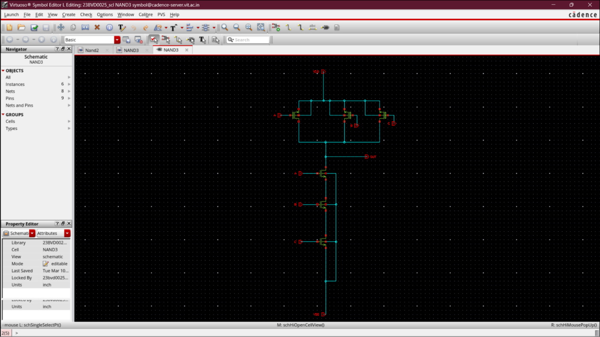

# Three-Input CMOS NAND Gate (NAND3)

## Overview
The **NAND3** standard cell is a three-input CMOS NAND logic gate designed using standard **180 nm CMOS technology** in Cadence Virtuoso. 

Within this repository, the NAND3 gate serves as a critical logical element in edge-triggered digital sequential designs. It is utilized in the **Phase Frequency Detector (PFD)** to implement the high-speed reset path that clears both master-slave control signals when a lead-lag lock is achieved.

---

## Cell Symbol and Schematic View
To integrate the NAND3 standard cell into hierarchical architectures (such as the reset logic of the Phase Frequency Detector), a custom symbol view was generated alongside the transistor-level schematic:

| Virtuoso Symbol View | Virtuoso Schematic View |
|:---:|:---:|
|  |  |

---

## Pin Configurations
The cell block exposes the following standard interfaces:

- **Input Pins (`A`, `B`, `C`)**: High-impedance CMOS gates designed to interface with digital control domains.
- **Output Pin (`OUT`)**: Low-impedance CMOS driver routing logical combinations.
- **Power Supply Pins (`VDD`, `VSS`)**: Dedicated supply rails clamped at $1.8\text{ V}$ and $0\text{ V}$ respectively.

---

## CMOS Topology & Design Considerations

```
              VDD
        ┌──────┴──────┐
     M0 ┶ A        M1 ┶ B      M2 ┶ C    (PMOS Pull-Up Parallel Array)
        └──────┬──────┘
               ├───────────── OUT
             M3 ┮ A
               │
             M4 ┮ B                      (NMOS Pull-Down Series Stack)
               │
             M5 ┮ C
               │
              VSS
```

### Stacked Channel Impedance Tuning:
- **Pull-Up Network**: Consists of three PMOS transistors in parallel ($M_0, M_1, M_2$), which pull the output to $V_{DD}$ if any input is logic-low (`0`).
- **Pull-Down Network**: Consists of three stacked NMOS transistors in series ($M_3, M_4, M_5$), which pull the output to ground only when all inputs are logic-high (`1`).
- **Aspect Ratio Matching**: Since three NMOS transistors are stacked in series, the effective pull-down channel resistance increases by $3\times$. To maintain symmetric rise and fall edge delay performance, NMOS aspect ratios ($W/L$) are sized larger ($3\times$) to prevent dynamic transition bottlenecks.

---

## Logical Truth Table

| Input A | Input B | Input C | PMOS Array Status | NMOS Stack Status | Output (OUT) |
|:---:|:---:|:---:|:---:|:---:|:---:|
| **0** | **0** | **0** | $M_0, M_1, M_2$ ON | $M_3, M_4, M_5$ OFF | **1** ($V_{DD}$) |
| **0** | **0** | **1** | $M_0, M_1$ ON, $M_2$ OFF | $M_3, M_4$ OFF, $M_5$ ON | **1** ($V_{DD}$) |
| **0** | **1** | **0** | $M_0, M_2$ ON, $M_1$ OFF | $M_3, M_5$ OFF, $M_4$ ON | **1** ($V_{DD}$) |
| **0** | **1** | **1** | $M_0$ ON, $M_1, M_2$ OFF | $M_3$ OFF, $M_4, M_5$ ON | **1** ($V_{DD}$) |
| **1** | **0** | **0** | $M_1, M_2$ ON, $M_0$ OFF | $M_4, M_5$ OFF, $M_3$ ON | **1** ($V_{DD}$) |
| **1** | **0** | **1** | $M_1$ ON, $M_0, M_2$ OFF | $M_4$ OFF, $M_3, M_5$ ON | **1** ($V_{DD}$) |
| **1** | **1** | **0** | $M_2$ ON, $M_0, M_1$ OFF | $M_5$ OFF, $M_3, M_4$ ON | **1** ($V_{DD}$) |
| **1** | **1** | **1** | $M_0, M_1, M_2$ OFF| $M_3, M_4, M_5$ ON  | **0** ($V_{SS}$) |

---

## Pre-Layout vs. Post-Layout Timing Characterization

To evaluate the dynamic switching performance under stacked series channel constraints, transient characterization was performed under a load capacitance ($C_L$) of $15\text{ fF}$:

### 1. Pre-Layout Delay Evaluation
- **High-to-Low Delay ($t_{PHL}$)**: $61.12\text{ ps}$
- **Low-to-High Delay ($t_{PLH}$)**: $55.28\text{ ps}$
- **Average Propagation Delay ($t_{pd1}$)**:
  $$t_{pd1} = \frac{t_{PHL} + t_{PLH}}{2} = 58.20\text{ ps}$$

### 2. Post-Layout Delay (RC-Extracted Netlist)
- **High-to-Low Delay ($t_{PHL}$)**: $73.34\text{ ps}$
- **Low-to-High Delay ($t_{PLH}$)**: $65.46\text{ ps}$
- **Average Propagation Delay ($t_{pd2}$)**:
  $$t_{pd2} = \frac{t_{PHL} + t_{PLH}}{2} = 69.40\text{ ps}$$

### 3. Parasitic Delay Penalty
Slightly higher than NAND2 due to the three-level serial transistor stacking adding intermediate node diffusion capacitances:
$$\text{Delay Penalty} = \frac{t_{pd2} - t_{pd1}}{t_{pd1}} \times 100 = 19.24\%$$

---

## Physical Verification & Sign-Off

The physical layout was designed following a standard-cell grid model and underwent complete sign-off verification using both Cadence Assura and Mentor Graphics Calibre tool suites:
1. **Design Rule Checking (DRC)**: Passed with zero violations using both Assura DRC and Calibre DRC. All spacing, enclosure, and minimum area rules for the 180 nm CMOS ruleset are fully satisfied.
2. **Layout Versus Schematic (LVS)**: 100% matched. Signed off cleanly via Assura LVS and Calibre LVS. The physical layout netlist matches the logical schematic perfectly, ensuring zero connectivity, matching, or parameter violations.
3. **Parasitic RC Extraction (RCX)**: Parasitics were extracted using Assura QRC and Calibre PEX to produce the post-layout simulation netlist, validating noise immunity and timing margins.

