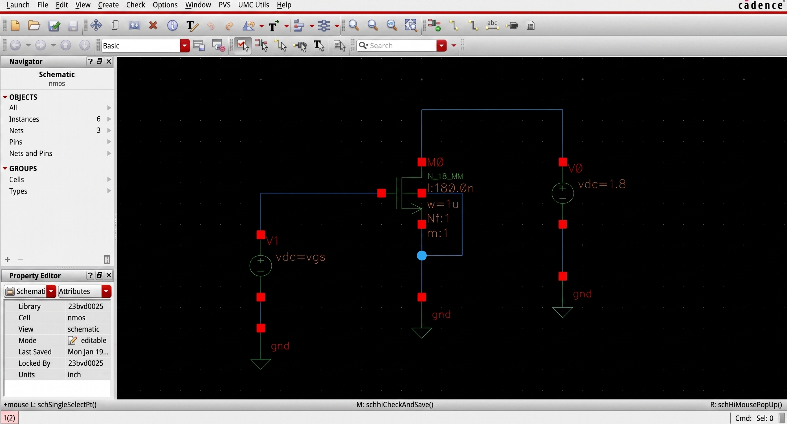
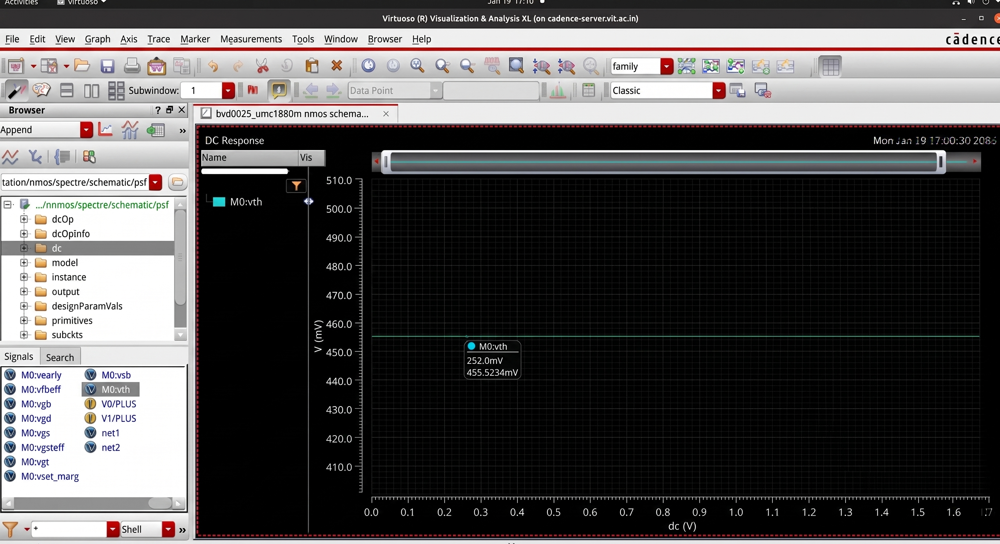
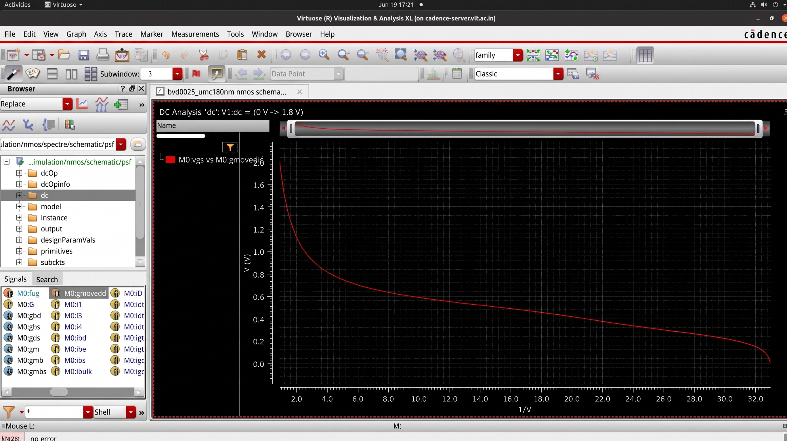
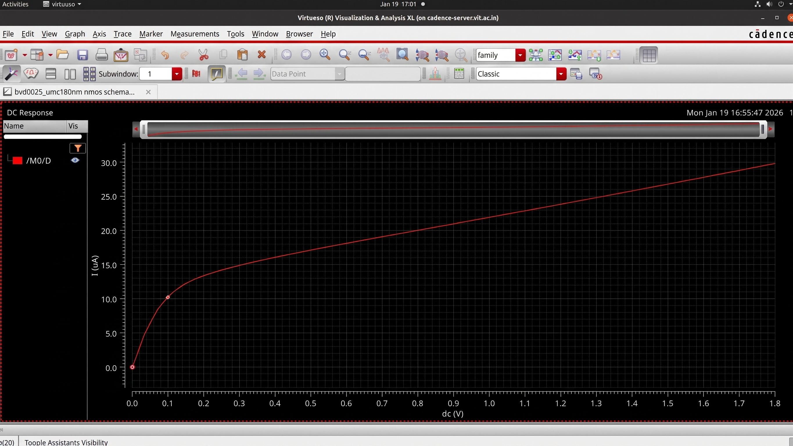
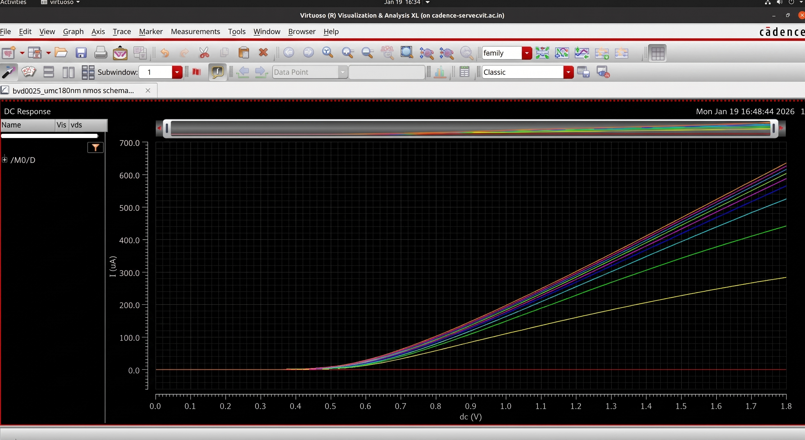
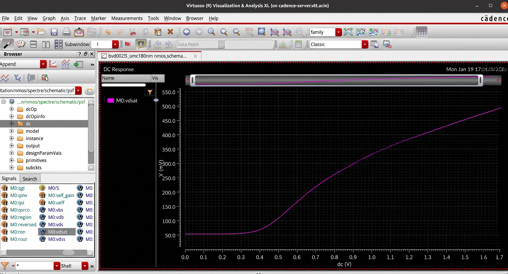
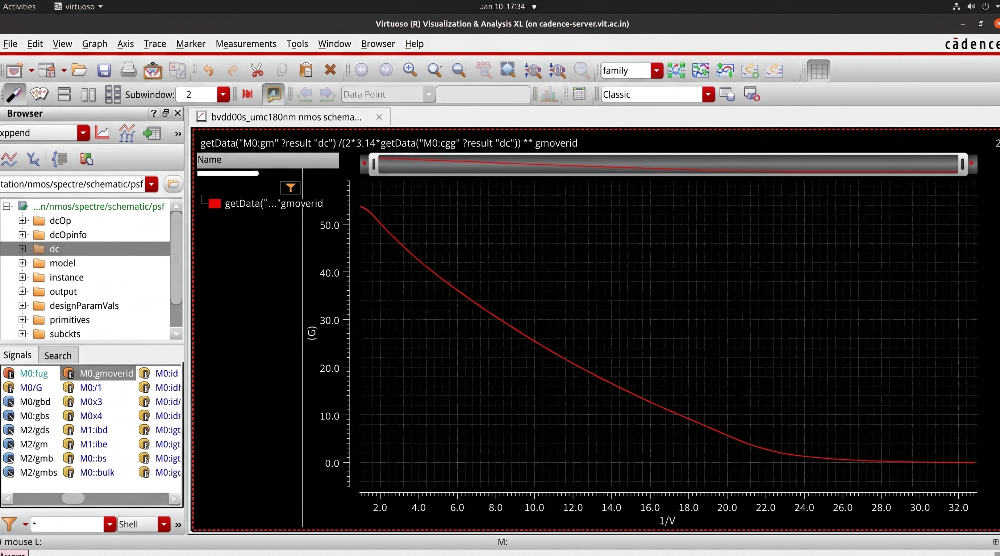

# NMOS Device Characterization

## Overview

This section presents transistor-level characterization of an NMOS device for analog and mixed-signal circuit design applications. The objective is to analyze device behavior under different biasing conditions and extract parameters used for transistor sizing and gm/Id based design methodologies.

The characterization includes:

- Transfer characteristics
- Output characteristics
- Threshold voltage extraction
- Transconductance analysis
- gm/Id methodology
- Gate capacitance behavior
- Transition frequency analysis
- Saturation characteristics

---

## Device Schematic

The following schematic was used to perform transistor characterization.

---

# Transfer Characteristics

Transfer characteristics show how drain current and small-signal parameters vary with gate voltage.

---

### Drain Current vs Gate Voltage (Id–Vgs)

Shows the variation of drain current with gate voltage and helps identify operating regions.

**Purpose**
- Observe device turn-on behavior
- Determine strong and weak inversion regions
- Analyze current scaling

---

### Transconductance vs Gate Voltage (gm–Vgs)

Shows sensitivity of drain current with respect to gate voltage.

**Purpose**

- Determine transistor gain capability
- Identify optimum bias points
- Estimate analog performance

---

### Threshold Voltage Extraction

Used to estimate threshold voltage (Vth) of the device.

**Purpose**

- Determine transistor turn-on voltage
- Compare process behavior
- Support device modeling

---

### Transition Frequency vs Gate Voltage (ft–Vgs)

Shows high-frequency response variation.

**Purpose**

- Estimate speed limitations
- Analyze RF capability
- Determine optimal operating region

---

### Gate Voltage vs gm/Id

Plots gate voltage against gm/Id ratio.

**Purpose**

- Support gm/Id design methodology
- Select bias conditions
- Optimize power-performance tradeoffs

---

# Output Characteristics

Output characteristics describe drain current variation with drain voltage.

---

### Drain Current vs Drain Voltage (Id–Vds)

Shows NMOS behavior in linear and saturation regions.

**Purpose**

- Identify operating regions
- Observe channel-length modulation
- Study output resistance behavior

---

### Drain Current vs Gate Voltage for Multiple Vds Values

Transfer characteristics for different drain voltages.

**Purpose**

- Analyze Vds dependence
- Observe short-channel effects
- Evaluate device behavior under different bias conditions

---

### Saturation Voltage vs Gate Voltage

Shows variation of saturation voltage with gate voltage.

**Purpose**

- Determine saturation boundary
- Support analog bias design

---

# gm/Id Methodology Analysis

The gm/Id methodology provides a systematic approach for transistor sizing in analog design.

---

### gm/Id vs Vgs

Shows efficiency variation with gate voltage.

**Purpose**

- Determine operating efficiency
- Support transistor sizing

---

### Current Density vs gm/Id (Id/W–gm/Id)

Shows the variation of current density with efficiency.

**Purpose**

- Determine optimal transistor sizing
- Analyze power-performance tradeoffs

---

### Gate Capacitance vs Gate Voltage (Cgs–Vgs)

Shows capacitance variation.

**Purpose**

- Analyze dynamic behavior
- Estimate loading effects

---

### Transition Frequency vs gm/Id

Shows speed-efficiency tradeoff.

**Purpose**

- Select optimal transistor operating point
- Study performance-power tradeoffs

---

# Key Observations

- Threshold voltage extraction was performed from transfer characteristics
- Linear and saturation regions were identified from output curves
- gm/Id methodology was used for efficient transistor sizing
- Frequency response and capacitance effects were analyzed
- Device characteristics were examined for analog design applications

---

# Tools Used

- Cadence Virtuoso
- Analog Design Environment (ADE)
- Device Simulation Setup
- Process Design Kit (PDK)

---