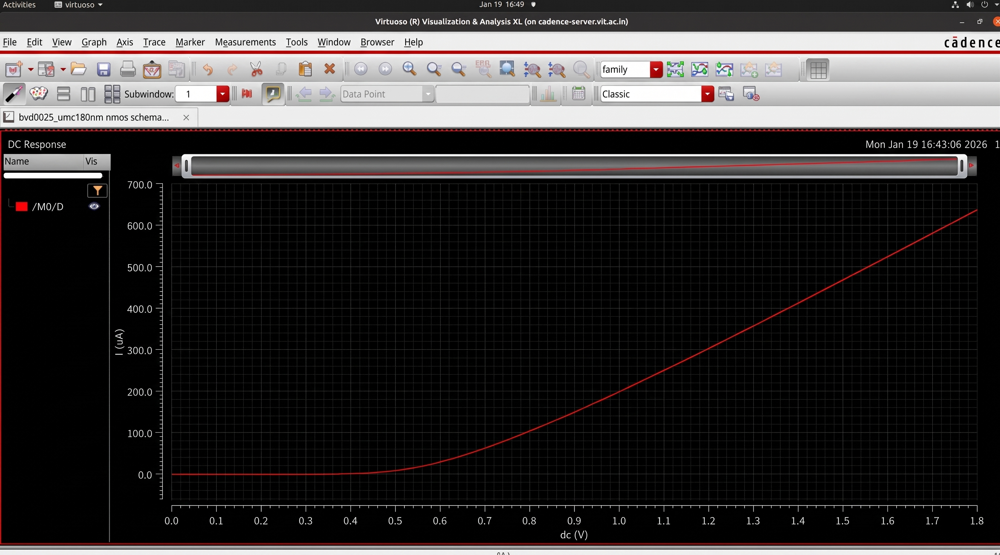
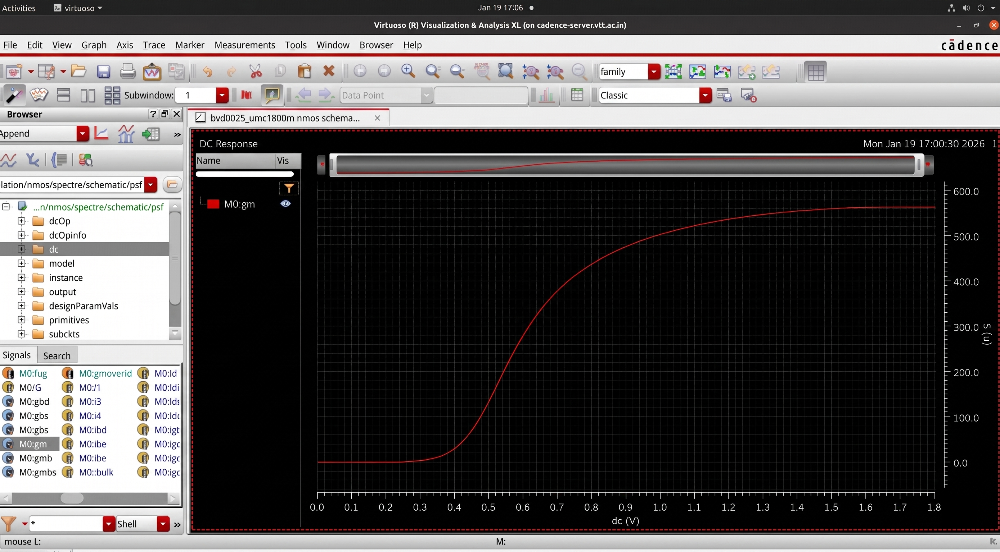
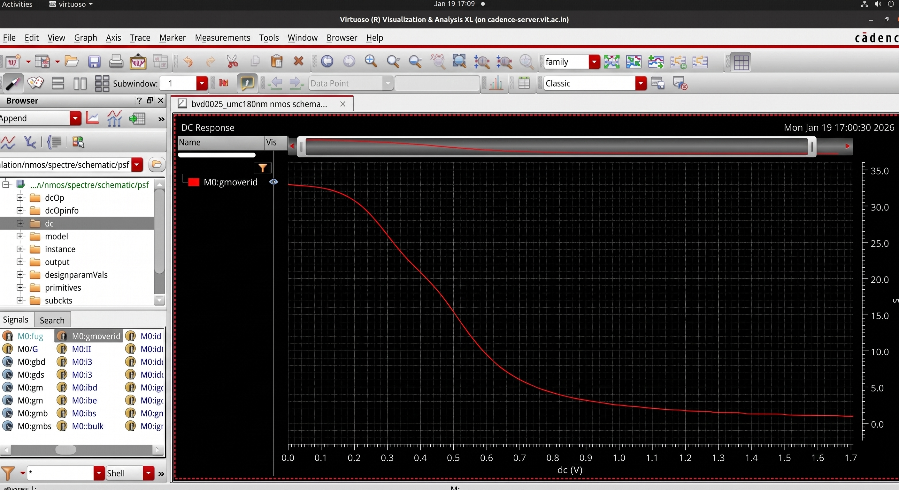
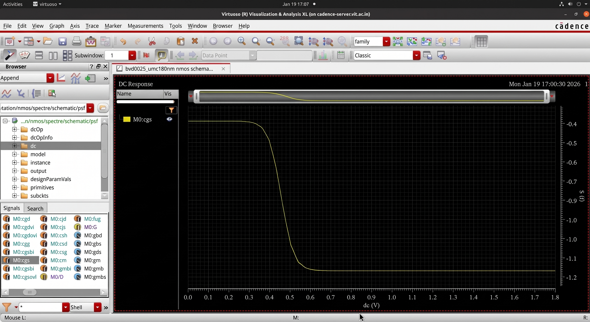
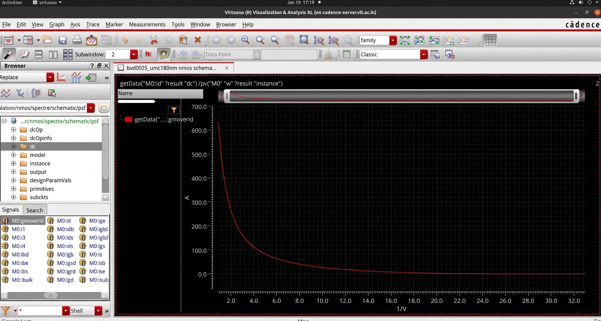
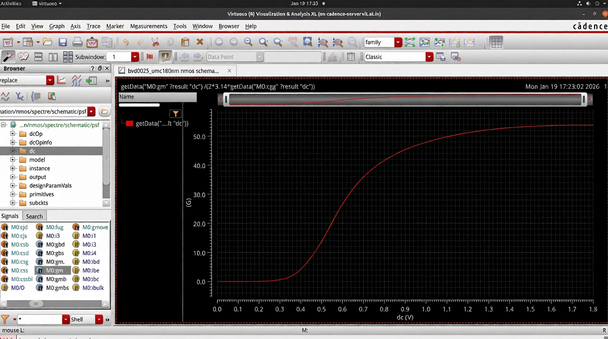

# NMOS Device Characterization

## Overview

NMOS device characterization was performed in Cadence Virtuoso to extract transistor-level parameters for analog design and gm/Id methodology.

## Design Environment

| Parameter | Value |
|------------|--------|
| Tool | Cadence Virtuoso |
| Libraries | UMC18 / ts018_scl_prim / gpdk090 |
| Analysis | DC Analysis |

---

## Extracted Parameters

- ID vs VGS
- ID vs VGS for multiple VDS
- ID vs VDS
- gm vs VGS
- gm/ID vs VGS
- Vth vs VGS
- VDSAT vs VGS
- ID/W vs gm/ID
- ft vs gm/ID
- ft vs VGS
- Cgs vs VGS
- Body effect

---

## Channel Length Modulation

λ = 0.189

---

## Results

### ID vs VGS

### ID vs VDS

### gm vs VGS

### gm/ID vs VGS

### Cgs vs VGS

### Vth vs VGS

### VDSAT vs VGS

### ID/W vs gm/ID

### ft vs gm/ID

### ft vs VGS

### Body Effect

---

## Key Observations

- Drain current increases with gate voltage
- Body bias increases threshold voltage
- gm/ID decreases in strong inversion
- Channel length modulation impacts saturation current