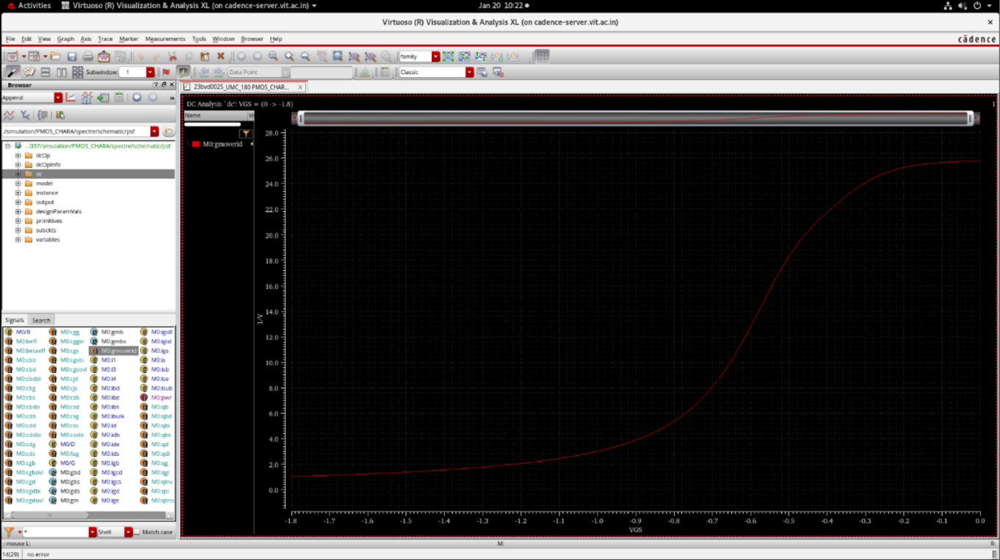

# PMOS Device Characterization

## Overview

PMOS characterization was performed for extraction of device parameters used in analog circuit design and gm/Id sizing methodology.

## Design Environment

| Parameter | Value |
|------------|--------|
| Tool | Cadence Virtuoso |
| Libraries | UMC18 / ts018_scl_prim / gpdk090 |
| Analysis | DC Analysis |

---

## Extracted Parameters

- ID vs VGS
- ID vs VDS
- gm/ID vs VGS
- ID/W vs gm/ID
- ft vs VGS
- ft vs gm/ID
- Body effect

---

## Channel Length Modulation

λ = 0.153

---

## Results

### ID vs VGS

### ID vs VDS

### gm/ID vs VGS

### ID/W vs gm/ID

### ft vs VGS

### ft vs gm/ID

### Body Effect

---

## Key Observations

- PMOS exhibits saturation and linear operating regions
- Current magnitude increases with gate bias
- Body bias changes threshold voltage
- Channel length modulation affects output characteristics