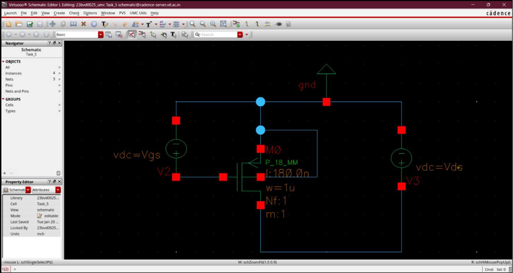
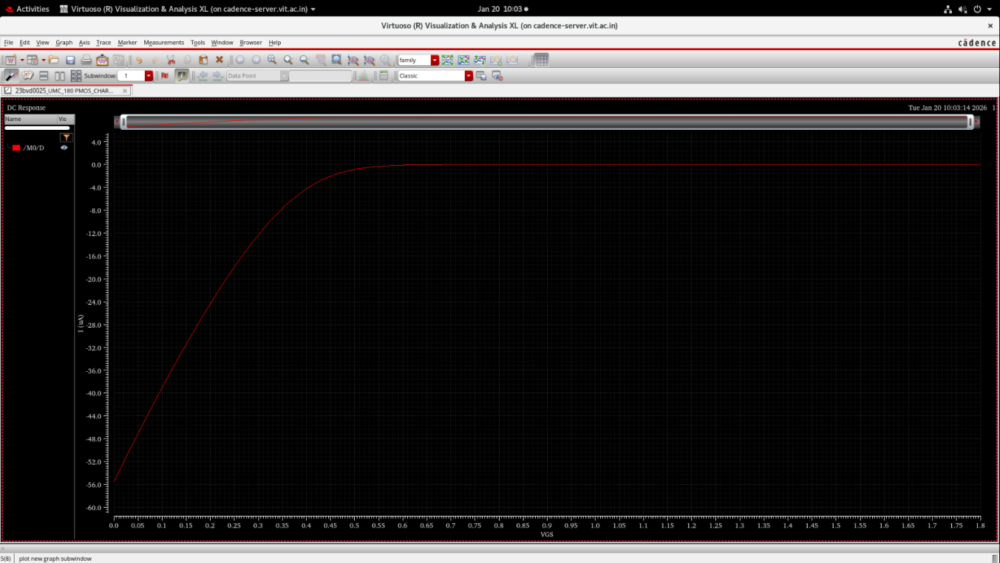
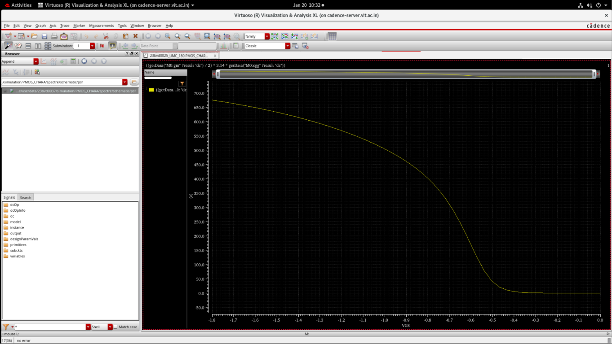
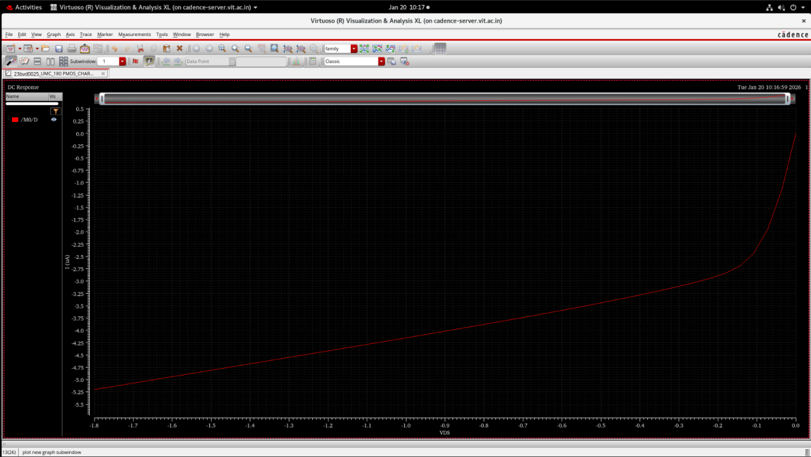
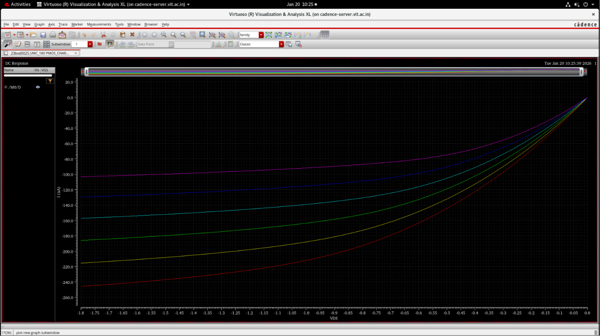
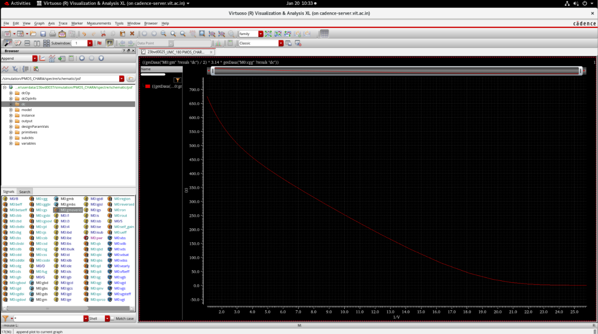

# PMOS Device Characterization

## Overview

This section presents transistor-level characterization of a PMOS device for analog and mixed-signal circuit design applications. The objective is to study PMOS behavior under different biasing conditions and extract parameters used for transistor sizing and gm/Id design methodologies.

The characterization includes:

- Transfer characteristics
- Output characteristics
- Threshold voltage extraction
- Transconductance analysis
- gm/Id methodology
- Gate capacitance behavior
- Transition frequency analysis
- Saturation characteristics
- Channel length modulation
- Body effect analysis

---

## Device Schematic

The following schematic was used for PMOS characterization.

---

# Transfer Characteristics

Transfer characteristics show how drain current and small-signal parameters vary with gate-source voltage.

---

### Drain Current vs Gate Voltage (ID–VSG)

Shows variation of drain current with gate voltage.

**Purpose**

- Observe PMOS turn-on behavior
- Determine weak and strong inversion regions
- Analyze current variation

---

### Transconductance vs Gate Voltage (gm–VSG)

Shows sensitivity of drain current with respect to gate voltage.

**Purpose**

- Analyze gain capability
- Determine optimum operating region

---

### Threshold Voltage Extraction

Shows extracted threshold voltage characteristics.

**Purpose**

- Determine PMOS turn-on voltage
- Verify device characteristics

---

### Transition Frequency vs Gate Voltage (ft–VSG)

Shows frequency response variation.

**Purpose**

- Determine high-frequency performance
- Study speed limitations

---

### Gate Voltage vs gm/Id

Shows relationship between gate voltage and gm/Id.

**Purpose**

- Support transistor sizing
- Determine operating efficiency

---

# Output Characteristics

Output characteristics describe current variation with drain-source voltage.

---

### Drain Current vs Drain Voltage (ID–VSD)

**Purpose**

- Identify operating regions
- Observe saturation characteristics

---

### Drain Current vs Gate Voltage for Multiple VSD

**Purpose**

- Study bias dependence
- Observe short-channel behavior

---

### Saturation Voltage vs Gate Voltage

**Purpose**

- Determine saturation conditions

---

# gm/Id Design Analysis

---

### gm/Id vs VSG

**Purpose**

- Analyze current efficiency

---

### gm/Id vs VSD

**Purpose**

- Study bias sensitivity

---

### Gate Capacitance vs Gate Voltage

**Purpose**

- Analyze dynamic performance

---

### Transition Frequency vs gm/Id

**Purpose**

- Study speed-efficiency tradeoffs

---

# Key Observations

- PMOS characteristics are complementary to NMOS behavior
- Device operation observed in linear and saturation regions
- gm/Id methodology used for transistor sizing
- Frequency and capacitance effects analyzed
- Device characteristics useful for analog and mixed-signal design

---

# Future Work

- Parameter extraction
- PMOS vs NMOS comparison
- Transistor sizing analysis
- PLL circuit integration
- Bootstrapped switch implementation

---

# Tools Used

- Cadence Virtuoso
- Analog Design Environment (ADE)
- Device Simulation Setup
- Process Design Kit (PDK)

---