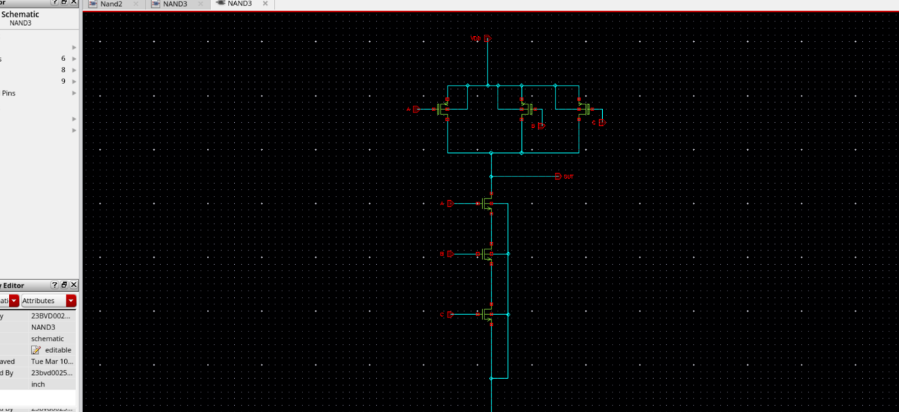
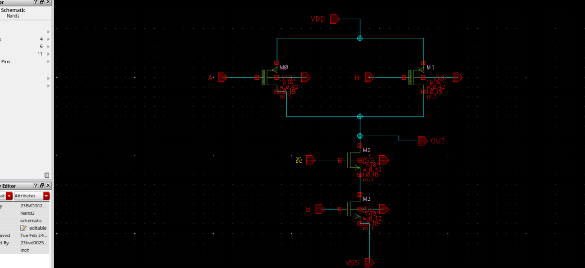
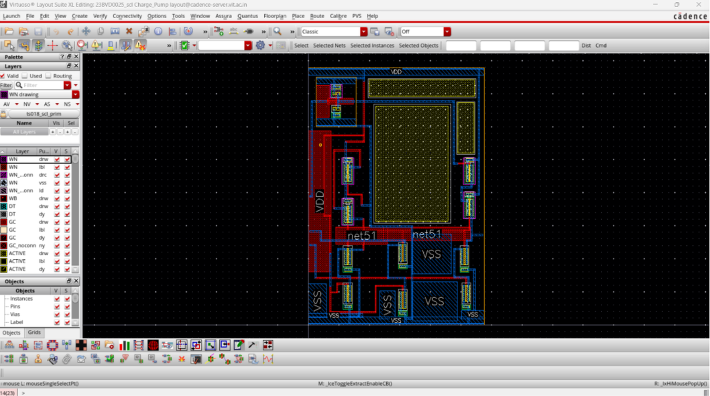

# Charge Pump Design and Implementation

## Overview
This section presents the design and implementation of a high-performance Charge Pump (CP) architecture using SCL 180 nm CMOS technology. 

A charge pump is an essential component in a Phase-Locked Loop (PLL) system. It converts digital **UP** and **DOWN** control signals generated by the Phase Frequency Detector (PFD) into corresponding analog charging and discharging currents. These currents charge or discharge the loop filter network to generate the stable control voltage ($V_{ctrl}$) required by the Voltage Controlled Oscillator (VCO).

---

## Design Environment & Specifications

- **Design Tool**: Cadence Virtuoso
- **Technology Libraries**: `UMC18`, `ts018_scl_prim`, `gpdk090`
- **Technology Node**: SCL 180 nm
- **Analysis Type**: Transient Analysis

### Design Objectives
The charge pump's transient behavior and switching operations were fully analyzed to optimize:
- Charging operation
- Discharging operation
- Output voltage variation
- Hold-state stability and leakage
- Stability analysis across switching transitions

---

## Circuit Implementation & Operation

The charge pump architecture consists of:
- **UP / DOWN Control Inputs**: Digital signal lines driven by the PFD.
- **Current Source Branches**: Symmetrical PMOS charging and NMOS discharging branches.
- **Output Node**: Analog control voltage node ($V_{ctrl}$).
- **Bias & Switching Circuitry**: Steers currents with minimal charge injection and clock feedthrough.

### Functional Truth Table & Operation
- **UP = 1, DOWN = 0**: Charging current is supplied to the loop filter, increasing the output voltage.
- **UP = 0, DOWN = 1**: Discharging current is activated from the loop filter, decreasing the output voltage.
- **UP = DOWN = 0**: Hold condition is active; the output node is high-impedance, keeping the loop filter voltage stable.

### Transistor Sizing Parameters (180 nm CMOS Node)

| Circuit Function | Transistor Type | Width ($W$) | Length ($L$) | Multiplier ($m$) | Sizing Rationale |
|:---|:---|:---|:---|:---|:---|
| **PMOS Current Source** | PMOS | $40.0\ \mu\text{m}$ | $0.36\ \mu\text{m}$ | 2 | Large channel length reduces channel modulation ($\lambda$) and current mismatch |
| **NMOS Current Sink** | NMOS | $20.0\ \mu\text{m}$ | $0.36\ \mu\text{m}$ | 2 | Matched to PMOS branch current density and mobility ratio ($\approx 2$) |
| **PMOS Up-Switch** | PMOS | $20.0\ \mu\text{m}$ | $0.18\ \mu\text{m}$ | 1 | Minimum length for high-speed switching; wide width lowers switch resistance |
| **NMOS Down-Switch** | NMOS | $10.0\ \mu\text{m}$ | $0.18\ \mu\text{m}$ | 1 | Sized symmetrically for high switching frequency and matched propagation delay |
| **PMOS Bias Mirrors** | PMOS | $10.0\ \mu\text{m}$ | $0.36\ \mu\text{m}$ | 1 | Steady biasing voltage reference; robust noise margins |
| **NMOS Bias Mirrors** | NMOS | $5.0\ \mu\text{m}$ | $0.36\ \mu\text{m}$ | 1 | Reference current distribution with low sensitivity to power rail noise |

### Cadence Schematic

### Symbol Design

### Simulation Testbench

---

## Layout & Physical Verification

### Physical Layout
Physical layout of the Charge Pump featuring symmetrical transistor placing to minimize current mismatch and layout parasitics.

### DRC & LVS Verification
- **Calibre DRC (Design Rule Check)**: Fully verified using Calibre DRC to ensure complete compliance with the SCL 180 nm technology design rules, confirming a DRC-clean layout with zero violations.

- **Calibre LVS (Layout Versus Schematic)**: 100% netlist matching achieved between the physical layout and Virtuoso transistor schematic, confirming zero logical, parameter, or connectivity discrepancies.

---

## Simulation Results & Analysis

### Output Characteristics & Transient Response
Cadence transient simulation plots demonstrate:
1. **Charging response waveform**: Clean, linear voltage increase upon UP pulse activation.
2. **Discharging response waveform**: Linear voltage reduction upon DOWN pulse activation.
3. **Output voltage response**: Smooth rail-to-rail control voltage range.
4. **Current transition behavior**: Fast and symmetrical switching response with minimal overshoot.

---

## Technical Insights & Design Analysis

Transient characterization and layout verification confirm:
- **Symmetric Sourcing/Sinking Currents**: Symmetrical charging and discharging current magnitudes minimize static phase offsets in lock-state.
- **Stable Hold Condition**: High impedance at the output node ensures negligible voltage drift during hold states.
- **Minimal Switching Distortions**: Clock feedthrough and charge injection ripples are minimized, verifying robust switching performance.
- **Closed-Loop Compatibility**: Low current mismatch and stable step-response make this architecture ideal for high-performance closed-loop PLL systems.

---

## Applications
- Phase Locked Loop (PLL) systems
- Frequency synthesizers
- Loop filter control circuits
- Clock generation and recovery systems
- High-frequency distribution systems
