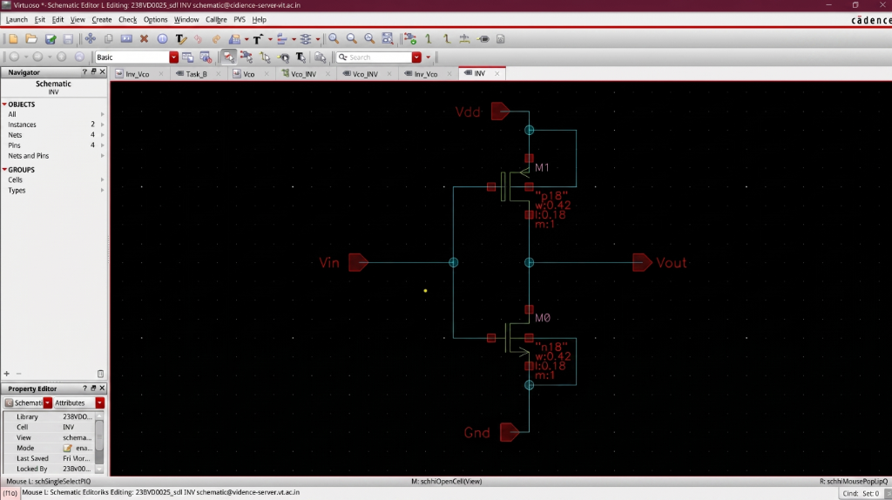
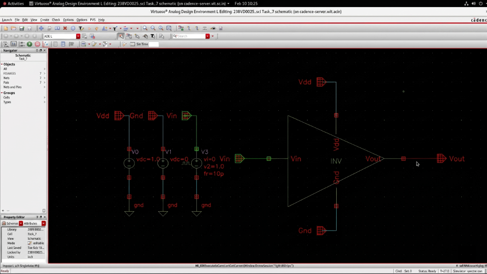
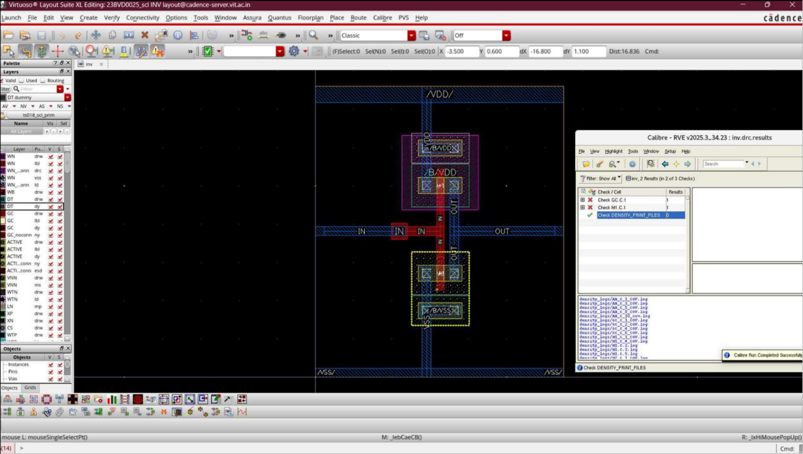
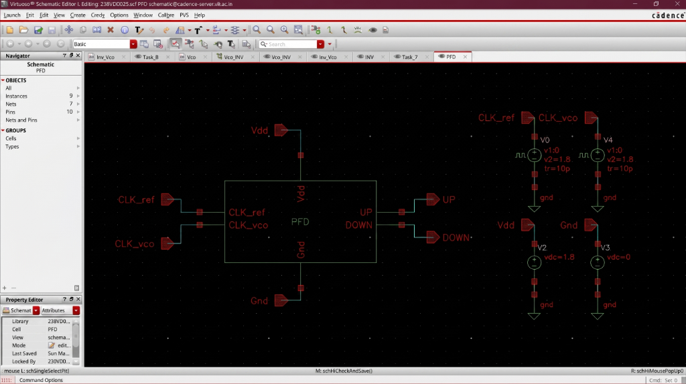

# Phase Frequency Detector (PFD)

## Overview
The Phase Frequency Detector (PFD) compares a reference clock (**CLKREF**) with the feedback clock from the VCO (**CLKVCO**) and generates **UP** and **DOWN** pulses that drive the charge‑pump. Implemented in SCL 180 nm CMOS technology and verified with transient analysis in Cadence Virtuoso.

---

## Design Specifications
| Parameter | Value |
|-----------|-------|
| Technology | SCL 180 nm CMOS |
| Supply Voltage | 1.8 V |
| Input Signals | CLKREF, CLKVCO |
| Output Signals | UP, DOWN |
| Tool | Cadence Virtuoso |

---

## Circuit Architecture

### Inverter Building Block
- **Schematic**: 
- **Symbol (TB View)**: 
- **Layout (DRC Checked)**: 

### Complete PFD Implementation
- **Schematic**: 
- **Symbol (TB View)**: 
- **Layout (DRC Checked)**: 

---

## Operating Principle
- **Reference leads feedback** → **UP** pulse generated → charge‑pump increases VCTRL → VCO speeds up.
- **Feedback leads reference** → **DOWN** pulse generated → charge‑pump decreases VCTRL → VCO slows down.
- **Lock condition** → both UP and DOWN are simultaneously reset, yielding narrow coincident pulses.

---

## Simulation & Validation Results

### Inverter Transient Response

### PFD Output Waveforms (Combined)

---

## Validation Summary
- Correct UP and DOWN pulse generation confirmed.
- Pulse widths scale proportionally with the phase difference.
- DRC‑clean layout verified for both the inverter cell and the full PFD.

---

## Observations
1. The dual‑DFF topology minimizes dead‑zone compared to XOR‑based PFDs.
2. The asynchronous reset path introduces a controlled delay that prevents dead‑zone near lock.
3. Output pulse widths accurately reflect phase error magnitude.

---

## Applications
- PLL frequency/phase acquisition
- Clock synchronization
- Clock‑and‑Data‑Recovery (CDR) systems

---

*All figures above correspond to the screenshots currently present in the repository.*
