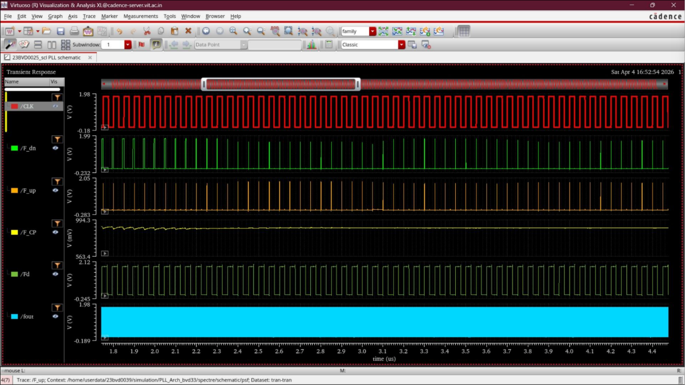

# Transistor-Level 2.56 GHz Phase-Locked Loop (PLL) Integration

This directory presents the complete top-level integration and physical design of a **2.56 GHz Phase-Locked Loop (PLL)** implemented in **SCL 180 nm CMOS technology**. 

The design brings together custom-designed sub-blocks - including the Phase Frequency Detector (PFD), Charge Pump, passive Loop Filter, current-starved Voltage Controlled Oscillator (VCO), and Divide-by-128 frequency counter - into a fully verified closed-loop frequency synthesizer.

---

## Key Specifications & Target Parameters

> [!IMPORTANT]
> The primary design objective is to synthesize a stable, low-jitter **2.56 GHz output** from a **20 MHz reference clock** using a loop multiplication factor of **128**.

| Design Parameter | Value / Metric | Description |
|:---|:---|:---|
| **Technology Node** | SCL 180 nm CMOS | Core process library for all sub-blocks |
| **Supply Voltage ($V_{DD}$)** | 1.8 V | Nominal power rail |
| **Output Frequency ($f_{out}$)** | 2.56 GHz | Steady-state closed-loop target |
| **Reference Frequency ($f_{ref}$)** | 20 MHz | Input clock from external source |
| **Division Factor ($N$)** | 128 ($2^7$) | Feedback frequency scaling factor |
| **Charge Pump Current ($I_{CP}$)** | 100 uA - 150 uA | Symmetric charging/discharging current |
| **Loop Filter Resistance ($R$)** | 1 kOhm | Passive integrator damping resistor |
| **Loop Filter Capacitance ($C_1$)** | 277 pF | Primary integration capacitor |

---

## Design Environment

* **Core CAD Suite**: Cadence Virtuoso
* **Technology Libraries**: `UMC18`, `ts018_scl_prim`, `gpdk090`
* **Analysis & Verification**: 
  * Closed-Loop Transient Analysis (ADE-L / Spectre)
  * Assura & Calibre Physical Verification (DRC & LVS)

---

## PLL System Block Diagram & Architecture

The block-level circuit diagram below highlights the signal routing, system interfaces, current-steering charging/discharging switches, and the closed-loop feedback structure:

### Sub-Block Specifications
* **Phase Frequency Detector (PFD)**: Compares the reference clock phase and the feedback divider phase to generate pulse-width modulated **UP** and **DOWN** signals.
* **Charge Pump (CP)**: Transports charge to/from the Loop Filter based on PFD error pulse widths.
* **Loop Filter (LF)**: Integrates current pulses to generate the analog control voltage ($V_{ctrl}$) with suppressed high-frequency ripples.
* **Voltage Controlled Oscillator (VCO)**: Produces the output frequency. Operating range spans $382.95\text{ MHz} - 4.09\text{ GHz}$ with a tuning gain ($K_{VCO}$) of $2.15 \times 10^{10}\text{ Hz/V}$.
* **Divide-by-128 Counter**: A cascaded chain of 7 D-flip-flop toggle stages dividing the VCO output down by 128 to match the 20 MHz reference phase.

---

## Schematic Implementation

The complete closed-loop transistor-level schematic is integrated hierarchy-wide in Cadence Virtuoso.

---

## Physical Layout & Silicon Verification

### Integrated Macro Layout
Symmetrical and isolated floorplanning of the analog sub-blocks (VCO, Loop Filter, Charge Pump) and digital cells (PFD, Counter) protects high-speed clock paths and minimizes substrate noise coupling.

### Physical Verification (Assura & Calibre DRC & LVS)
> [!TIP]
> The integrated PLL layout passed both Cadence Assura and Mentor Graphics Calibre DRC and LVS checks cleanly, confirming absolute structural correspondence with the schematic netlist and full compliance with 180 nm fabrication rules.

---

## Closed-Loop Simulation Results

### 1. Transient Locking Dynamics
At system start-up, the frequency offset between $f_{ref}$ and $f_{fb}$ causes the PFD to steer the Charge Pump. The loop filter control voltage ($V_{ctrl}$) ramps up and undergoes minor ringing before settling at its nominal lock-state voltage, pulling the VCO clock into phase alignment.

### 2. Locked-State Waveforms
Under locked conditions, all internal loops operate in absolute lock-state synchronization:
- Symmetrical, low-ripple $V_{ctrl}$ hold condition.
- Feedback clock ($f_{fb}$) aligned with the reference clock ($f_{ref}$).
- Stable, high-speed 2.56 GHz output waveforms.

---

## Design Analysis & Core Insights

1. **Fast Phase Acquisition**: Symmetrical current branch sizing ($I_{CP} = 100 - 150\ \mu\text{A}$) within the Charge Pump ensures zero static phase offset and highly balanced charging/discharging slew rates.
2. **Optimized Loop Dynamics**: The loop filter parameters ($R=1\text{ k}\Omega$, $C_1=277\text{ pF}$) balance the loop bandwidth and phase margin, resulting in rapid locking with minimal jitter.
3. **Substrate & Switching Noise Isolation**: Physical isolation of the current-starved ring oscillator from high-slew digital lines (PFD, Counter) minimizes clock coupling and phase jitter.
4. **Asynchronous Divider Speed**: Utilizing toggle DFF architectures for the 7 divider stages guarantees low accumulation delay at high VCO clock rates (2.56 GHz).

---

## Applications
- **RF Transceivers & Frequency Synthesizers**
- **High-Performance Clock Generation and Distribution**
- **Mixed-Signal Microcontrollers & Clock Multipliers**
- **High-Speed Serial Link Timing Recovery**
