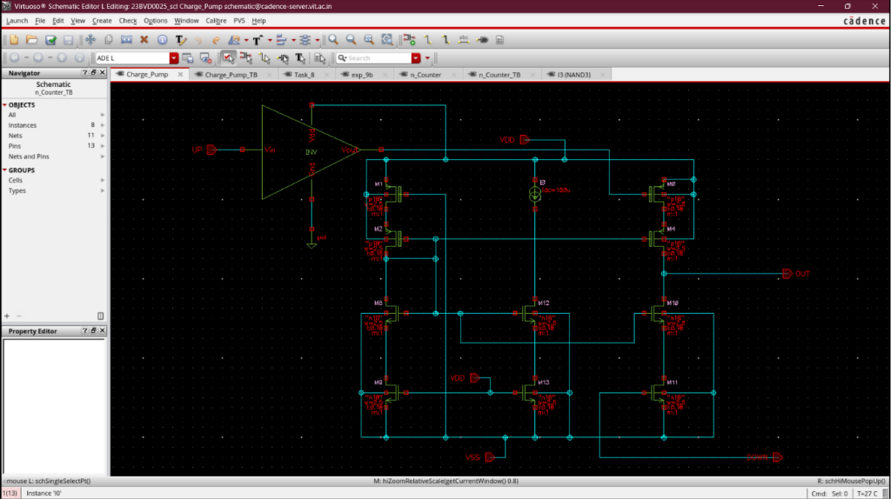
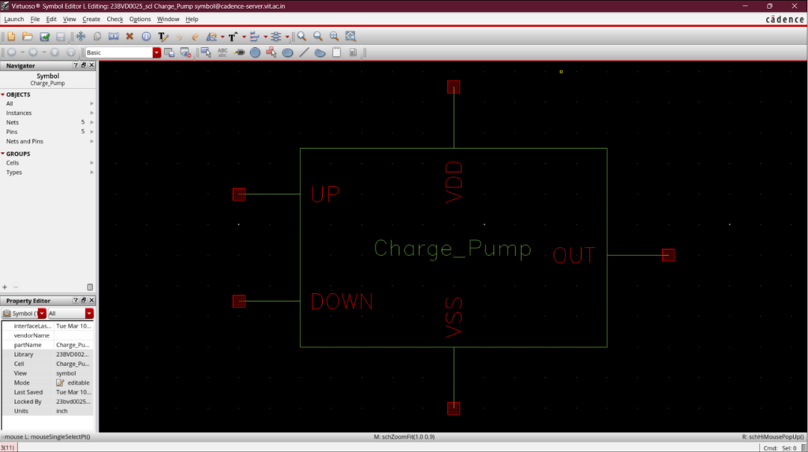
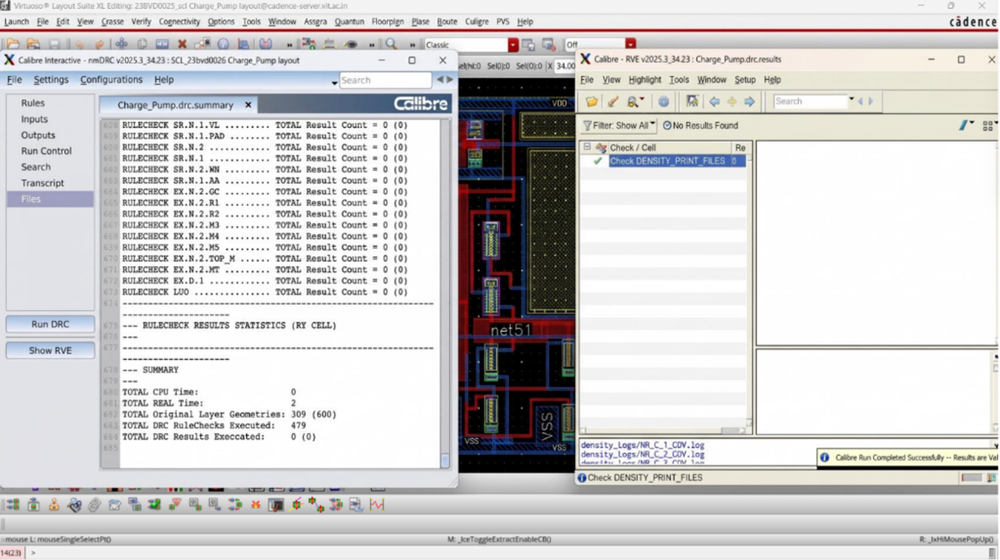

# Charge Pump

## Overview
The Charge Pump (CP) converts the digital UP and DOWN pulses generated by the Phase Frequency Detector into a proportional analog current. This current charges or discharges the loop filter capacitor, adjusting the VCO control voltage to correct any detected phase or frequency error in the PLL loop.

The implementation was carried out in SCL 180 nm CMOS technology using Cadence Virtuoso and verified through DRC with zero violations.

---

## Design Specifications

| Parameter | Value |
|-----------|-------|
| Technology | SCL 180 nm CMOS |
| Supply Voltage | 1.8 V |
| Input Signals | UP, DOWN |
| Output Signals | OUT1, OUT2 |
| Tool | Cadence Virtuoso |

---

## Circuit Architecture

### Charge Pump Internal Schematic
The charge pump uses matched PMOS current source branches (upper half) and NMOS current sink branches (lower half), controlled by the UP and DOWN signals through inverter buffering. The architecture ensures symmetric current injection and extraction.

### Charge Pump Symbol
The Cadence cell symbol for the Charge Pump block, showing the interface ports: UP, DOWN, VDD, VSS, and OUT.

### Charge Pump Testbench
The testbench instantiates two Charge Pump blocks (dual configuration) with shared UP/DOWN inputs, and captures OUT1 and OUT2 independently through separate load capacitors.

---

## Operating Principle

- **UP pulse active**: PMOS current source branch conducts, sourcing current into the loop filter. Output voltage increases.
- **DOWN pulse active**: NMOS current sink branch conducts, sinking current from the loop filter. Output voltage decreases.
- **Both signals inactive (locked state)**: No net current flows. Output voltage is held steady by the loop filter capacitor.

Matched PMOS/NMOS current source sizing ensures symmetric charge and discharge behavior, minimizing static phase offset at lock.

---

## Layout & Physical Verification

### Charge Pump Layout
Full transistor-level layout of the Charge Pump cell, showing the PMOS current source array (top), routing layers, and NMOS current sink array (bottom).

### Charge Pump Layout DRC
Calibre DRC run on the Charge Pump layout. The DRC summary confirms:
- All RULECHECK results: **0 violations**
- Total DRC Results Executed: **0 (0)**
- Calibre run completed successfully

---

## Validation Summary
- Correct UP signal charging behavior verified (output voltage increases).
- Correct DOWN signal discharging behavior verified (output voltage decreases).
- Stable hold condition confirmed when both UP and DOWN are inactive.
- Minimal output ripple observed.
- DRC-clean layout verified via Calibre with zero violations across all 479 rule checks.

---

## Observations
1. Current mismatch between UP and DOWN paths causes static phase offset; matched sizing is critical.
2. Switch transistor sizing affects dead-zone and leakage performance.
3. The charge pump directly determines PLL loop dynamics alongside the loop filter.
4. The dual-output testbench configuration allows simultaneous verification of two independent CP instances.

---

## Applications
- PLL phase error correction
- Loop filter control
- Frequency synthesizers
- Clock and data recovery systems
