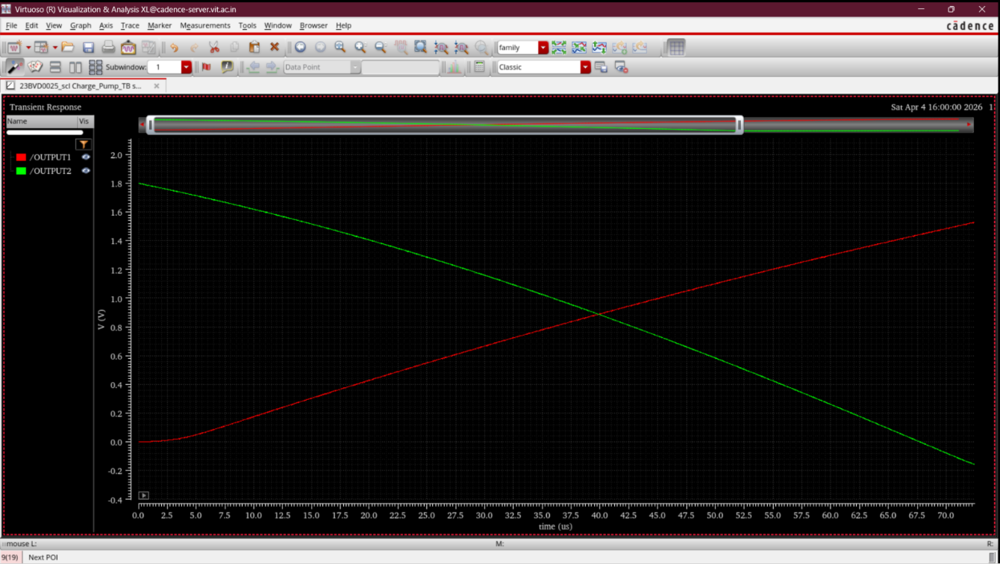

# Charge Pump

## Overview
The Charge Pump (CP) converts the digital UP and DOWN pulses from the Phase Frequency Detector into an analog current that charges or discharges the loop filter capacitor. This adjusts the VCO control voltage to correct any phase or frequency error in the PLL loop.

---

## Design Specifications

| Parameter | Value |
|-----------|-------|
| Supply Voltage | 1.8 V |
| Technology | UMC 180 nm |

---

## Circuit Architecture

### Cadence Schematic

---

## Operating Principle

- **UP pulse active**: PMOS current source charges the loop filter, increasing Vctrl and raising VCO frequency.
- **DOWN pulse active**: NMOS current sink discharges the loop filter, decreasing Vctrl and lowering VCO frequency.
- **Both signals inactive (locked state)**: No net current flows; Vctrl is held steady by the loop filter capacitor.

Matched current sources ensure symmetric charge and discharge behavior, minimizing static phase offset at lock.

---

## Simulation & Validation Results

### Output Current Transient

### Validation Summary
- Charge pump current sourcing and sinking verified.
- Symmetric UP/DOWN current magnitudes confirmed.
- Proper integration with PFD output pulses validated.

---

## Observations
1. Current mismatch between UP and DOWN paths introduces static phase offset; matched sizing is critical.
2. Switch transistor sizing affects dead-zone and leakage performance.
3. The charge pump directly determines PLL loop dynamics alongside the loop filter.

---

## Applications
- PLL phase error correction
- Frequency synthesizers
- Clock and data recovery systems
