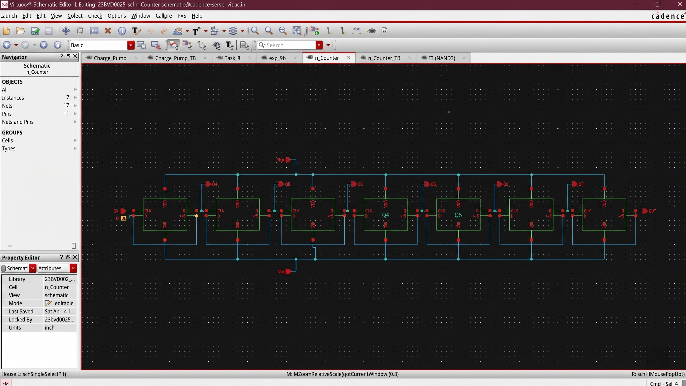
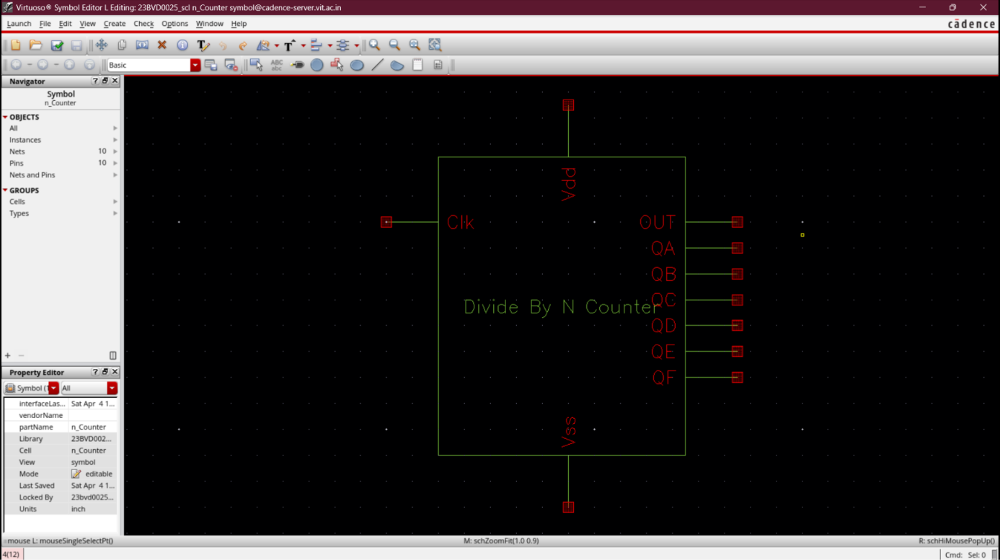
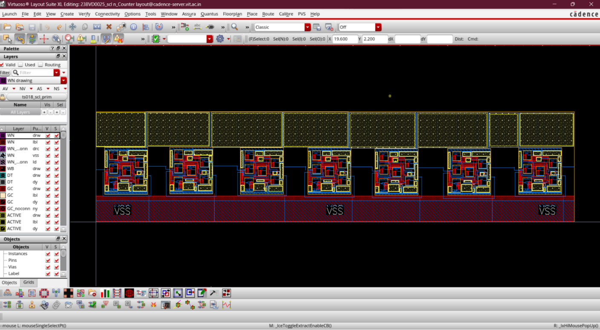
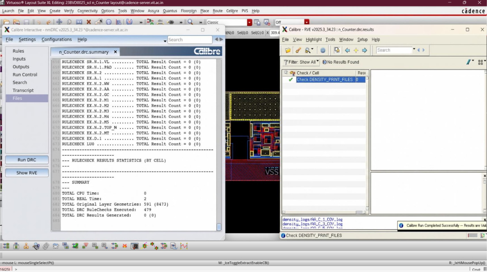
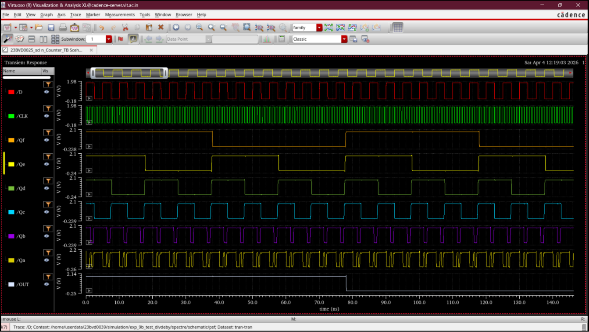

# Divide-by-128 Frequency Divider

## Aim
To design and implement a Divide-by-128 Counter using SCL 180 nm CMOS technology and verify its functionality through transient timing simulations in Cadence Virtuoso.

---

## Overview
The Divide-by-128 counter serves as the feedback frequency divider in the PLL loop. It divides the high-frequency VCO output clock ($f_{input} = 2.56\text{ GHz}$) down to a lower reference frequency ($f_{output} = 20\text{ MHz}$) using a division factor of $N=128$. This allows the Phase Frequency Detector (PFD) to compare the feedback signal against the reference clock, enabling the PLL to lock the VCO at exactly 128 times the reference frequency.

The architecture is implemented as a cascaded chain of **seven D flip-flop toggle stages**, where each stage halves the frequency of its input clock ($2^7 = 128$).

---

## Design Specifications

| Parameter | Value |
|-----------|-------|
| Technology Node | SCL 180 nm CMOS |
| Supply Voltage ($V_{DD}$) | 1.8 V |
| Division Ratio ($N$) | 128 ($2^7$) |
| Input Frequency ($f_{input}$) | 2.56 GHz |
| Output Frequency ($f_{output}$) | 20 MHz |
| Number of Cascaded Stages | 7 |
| Implementation | Cascaded D Flip-Flop (DFF) toggle configurations |

---

## Circuit Implementation

The Divide-by-128 counter circuit consists of:
- **Cascaded D Flip-Flop stages**: Seven DFF blocks connected in series with the inverting output ($\bar{Q}$) fed back to the $D$ input of each stage.
- **Clock input**: Transmits the high-frequency input clock to the primary stage.
- **Feedback path**: Connects intermediate stages and drives the clock input of the subsequent stage.
- **VDD & VSS supply**: Main power rails ($1.8\text{ V}$ and $0\text{ V}$).
- **Output nodes**: Probe points for clock waveforms at the output of each DFF stage.

### Cadence Schematic Features
1. **D Flip-Flop Chain**: Sequential toggling configurations.
2. **Counter Architecture**: Cascaded topology for binary frequency scaling.
3. **Clock Routing**: Structured clock tree pathways between stages.
4. **Device Interconnections**: Optimized transistor-level interconnections for speed and power.

### Cadence Schematic

### Symbol Design
The cell block symbol of the Frequency Divider used for top-level PLL system integration.

---

## Layout & Physical Verification

### Layout Design
Physical layout of the complete 7-stage frequency divider. The layout is optimized to minimize propagation delay skew and interconnect mismatch between stages.

### Physical Verification (DRC/LVS)
The physical layout was verified using Calibre DRC and LVS checks to ensure absolute compliance with the SCL 180 nm CMOS technology design rules. The validation results confirm a fully compliant, DRC-clean, and LVS-matched layout implementation.

---

## Simulation & Validation Results

### Output Characteristics
Simulation response demonstrates:
- **Frequency division operation**: Successful binary frequency scaling across all stages.
- **Counter stage outputs**: Outputs showing intermediate division divisions ($\div 2, \div 4, \div 8, \dots$).
- **Clock pulse scaling**: Visual evidence of clock period expansion.

### Observed Behavior
1. Input clock frequency progressively reduces across stages.
2. Output pulse frequency becomes exactly one hundred twenty-eight times lower than the input frequency.
3. Stable periodic output is observed without any cycle slip.
4. No missing pulses or timing anomalies are observed.

### Simulation Waveforms
The simulation plots contain:
1. Input clock waveform ($f_{input} = 2.56\text{ GHz}$).
2. Intermediate counter stage outputs.
3. Frequency-divided output waveform ($f_{output} = 20\text{ MHz}$).
4. Multi-stage transient timing response.

---

## Results

- **Input Frequency ($f_{input}$)**: $2.56\text{ GHz}$
- **Output Frequency ($f_{output}$)**: $20\text{ MHz}$
- **Division Factor ($N$)**: 128
- **Observed Characteristics**:
  - Stable output periodicity
  - Correct frequency scaling
  - No timing or setup/hold violations
  - Acceptable propagation delay through the cascade

---

## Inference

The Divide-by-128 counter was successfully designed, implemented, and verified using SCL 180 nm CMOS technology.
- Correct frequency division operation has been demonstrated across all division ratios.
- Highly stable output waveforms and proper clock scaling behavior verified.
- The design exhibits suitable performance and timing margins for high-frequency PLL feedback systems.

---

## Applications
- PLL frequency feedback loops
- Frequency division circuits
- Clock generation systems
- Digital timing and synchronization systems
