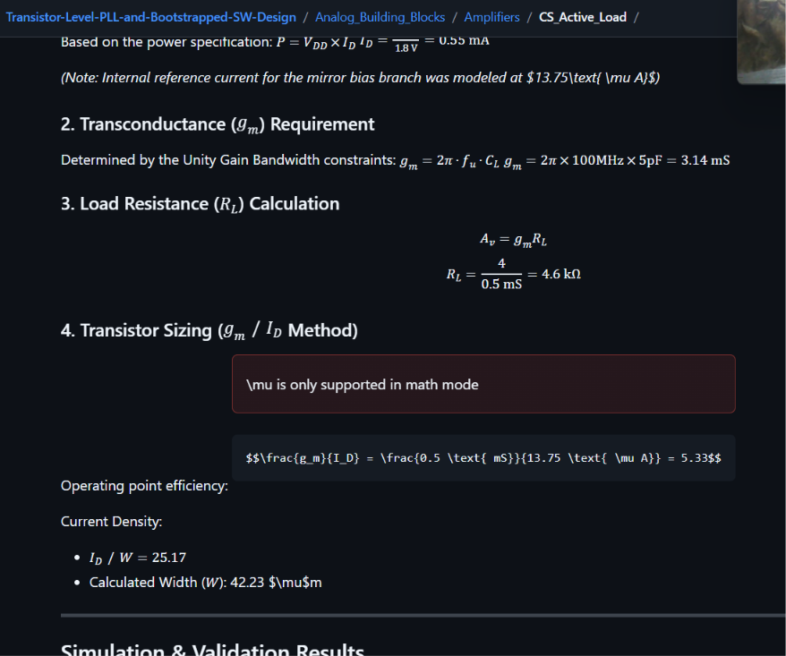
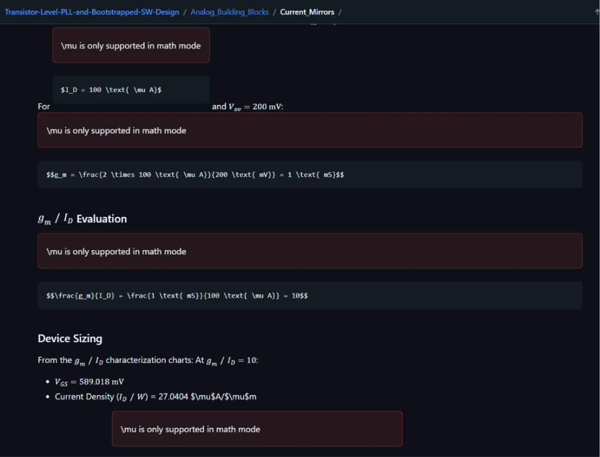
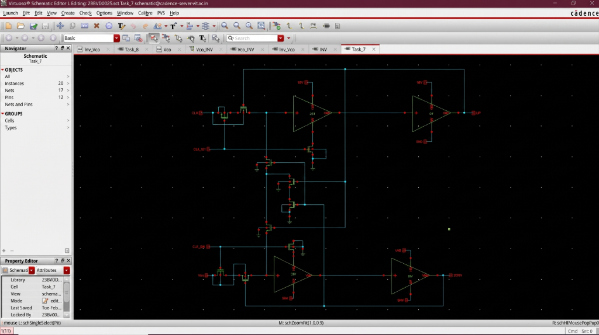
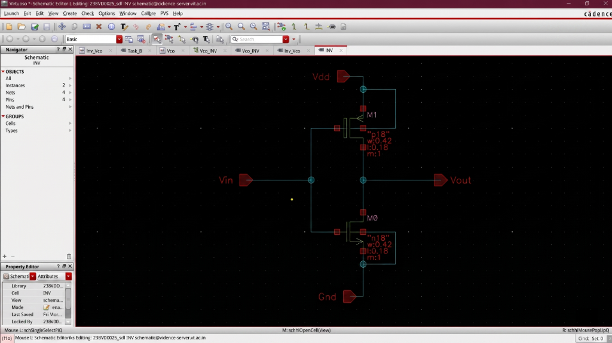
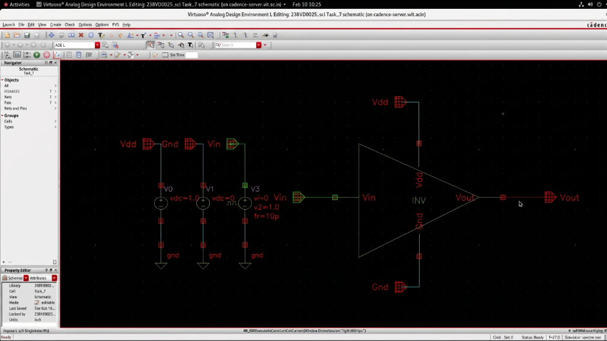
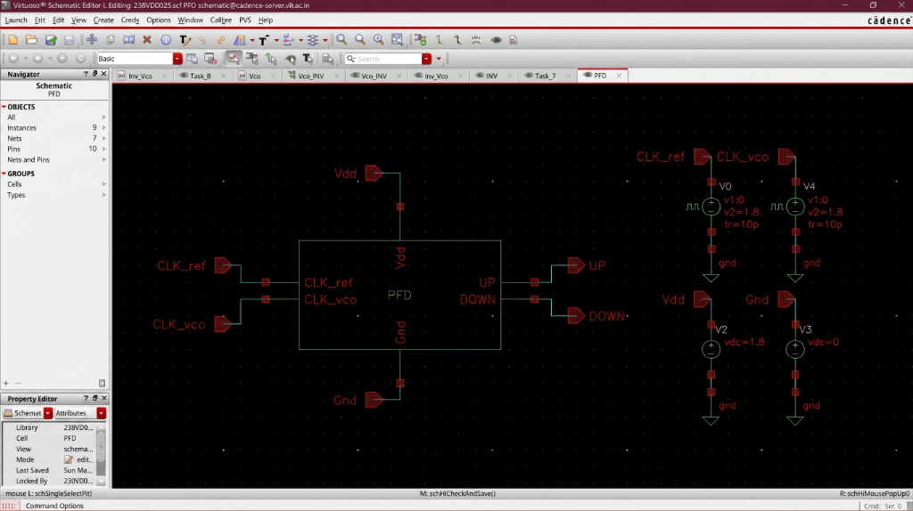
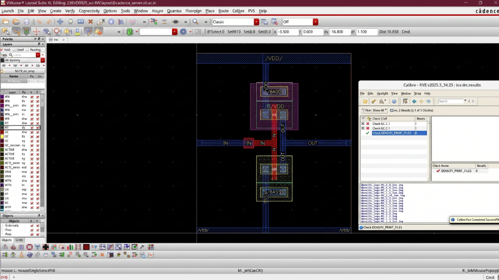
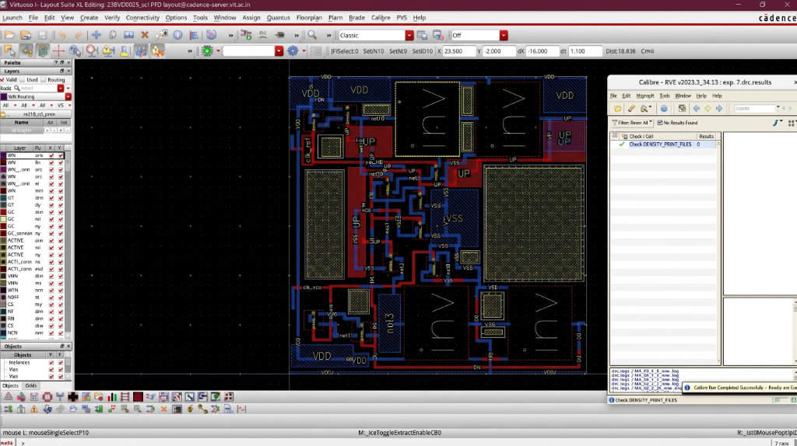
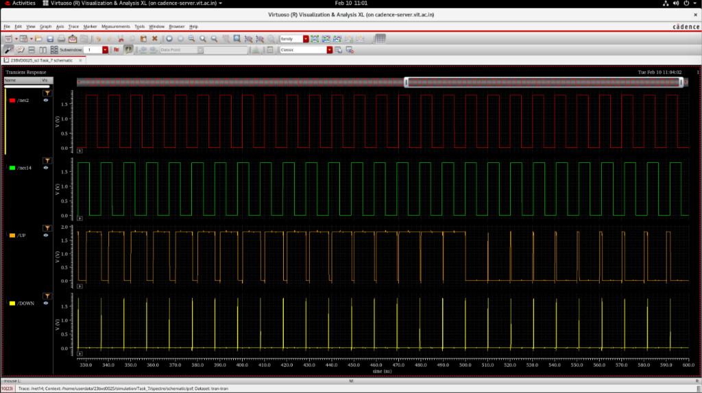

# Phase Frequency Detector (PFD)

## Overview
The Phase Frequency Detector (PFD) is a key sub-block of the Phase-Locked Loop system. It compares the phase and frequency of the reference clock (CLK_ref) against the VCO feedback clock (CLK_vco). Based on this comparison, it generates UP and DOWN control pulses that drive the charge pump to correct the VCO frequency.

The PFD is implemented using a dual-edge-triggered D flip-flop architecture with an asynchronous reset path. The implementation was carried out in SCL 180 nm CMOS technology using Cadence Virtuoso and verified through DRC.

---

## Design Specifications

| Parameter | Value |
|-----------|-------|
| Technology | SCL 180 nm CMOS |
| Supply Voltage | 1.8 V |
| Input Signals | CLK_ref, CLK_vco |
| Output Signals | UP, DOWN |
| Tool | Cadence Virtuoso |

---

## Circuit Architecture

### PFD Top-Level Schematic
The full PFD schematic uses two D flip-flop stages with an AND gate reset path. UP and DOWN outputs are buffered through inverter chains before being presented to the charge pump.

### Inverter Sub-Cell
The inverter cell (INV) is the fundamental building block used throughout the PFD. It uses a matched PMOS/NMOS pair with W = 0.42 um and L = 0.18 um.

### Inverter Testbench

### PFD Testbench
The PFD testbench applies independent CLK_ref and CLK_vco clock sources with a phase offset to verify correct UP/DOWN pulse generation.

---

## Operating Principle

The PFD operates on the following detection logic:

- **Reference leads feedback**: UP pulse is generated. The charge pump increases $V_{ctrl}$, which increases the VCO frequency until lock is achieved.
- **Feedback leads reference**: DOWN pulse is generated. The charge pump decreases $V_{ctrl}$, which decreases the VCO frequency until lock is achieved.
- **Phase-locked state**: Both UP and DOWN pulses are simultaneously reset via the AND gate feedback path, resulting in narrow coincident pulses that cancel out.

---

## Layout & Physical Verification

### Inverter Layout (DRC)
The inverter cell was individually laid out and verified through Calibre DRC. The DRC run completed successfully.

### PFD Layout (DRC)
The complete PFD layout was verified using Calibre DRC. The result shows **No Results Found**, confirming a DRC-clean implementation.

---

## Simulation & Validation Results

### Inverter Transient Response
Verifies correct inverting behavior: when Vin transitions high, Vout transitions low, and vice versa. Rail-to-rail switching is confirmed.

### PFD Clock and Output Waveforms
Shows CLK_ref (red) and CLK_vco (green) input clocks alongside the resulting UP (orange) and DOWN (yellow) output pulses across the full simulation window.

### PFD Transient Response (Zoomed View)
Zoomed-in view of the transient simulation showing the precise timing relationship between the reference/VCO clocks and the UP/DOWN pulse widths.

### PFD Transient Response (Extended View)

---

## Validation Summary
- Correct UP pulse generation verified when CLK_ref leads CLK_vco.
- Correct DOWN pulse generation verified when CLK_vco leads CLK_ref.
- Pulse widths scale correctly with the phase difference between the two clocks.
- Synchronized behavior confirmed at lock condition.
- DRC-clean layout verified via Calibre on both the inverter cell and the full PFD.

---

## Observations
1. The dual-DFF topology minimizes dead-zone compared to XOR-based PFDs.
2. The AND gate reset path introduces a small intentional delay that prevents dead-zone at near-lock conditions.
3. Output pulse widths correctly reflect the magnitude of the phase difference.
4. The inverter sub-cell layout passed DRC cleanly, confirming design rule compliance.
5. The full PFD layout passed DRC with zero violations.

---

## Applications
- PLL frequency/phase acquisition and lock
- Clock synchronization circuits
- Clock and Data Recovery (CDR) systems
