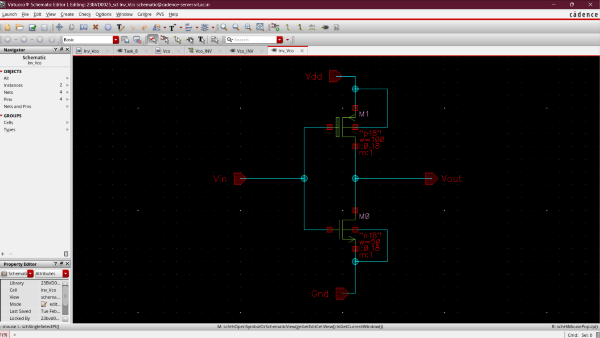
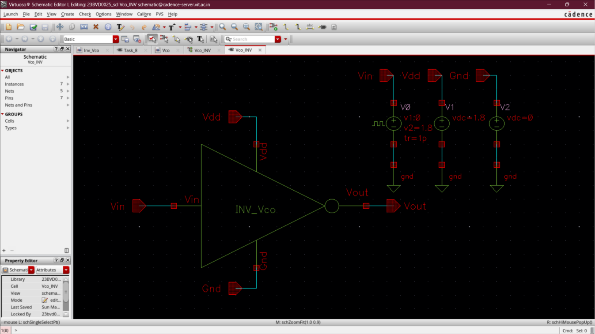
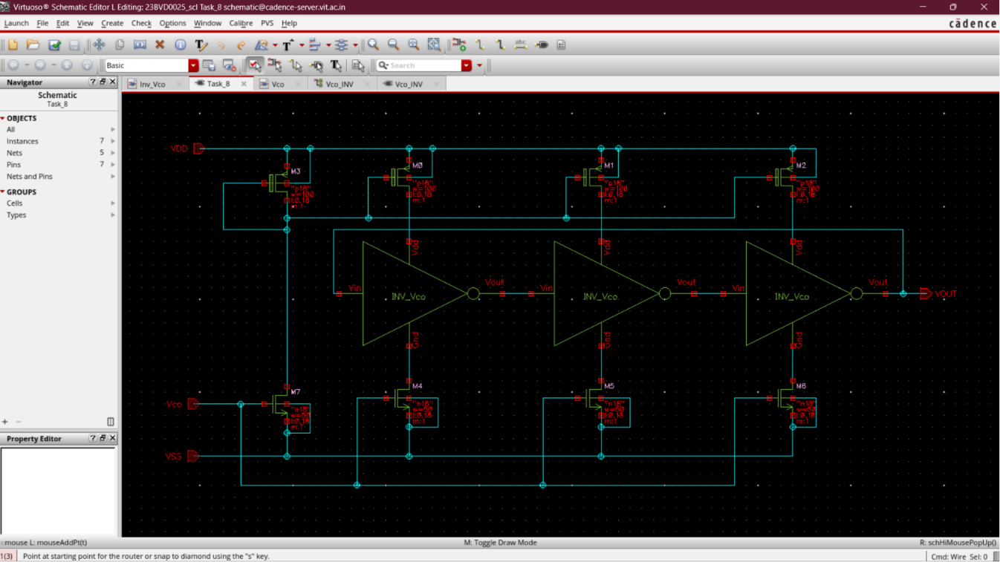
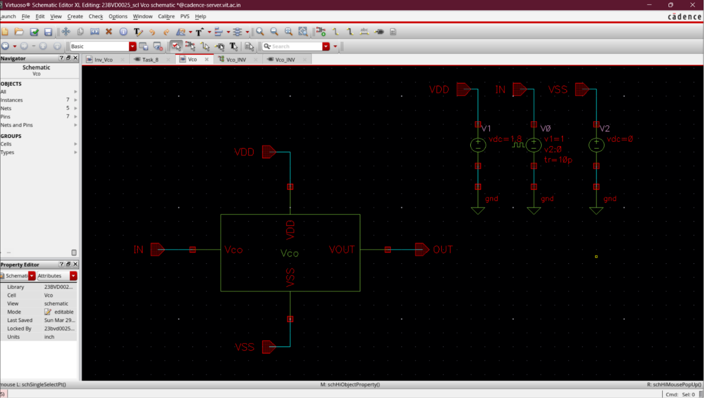
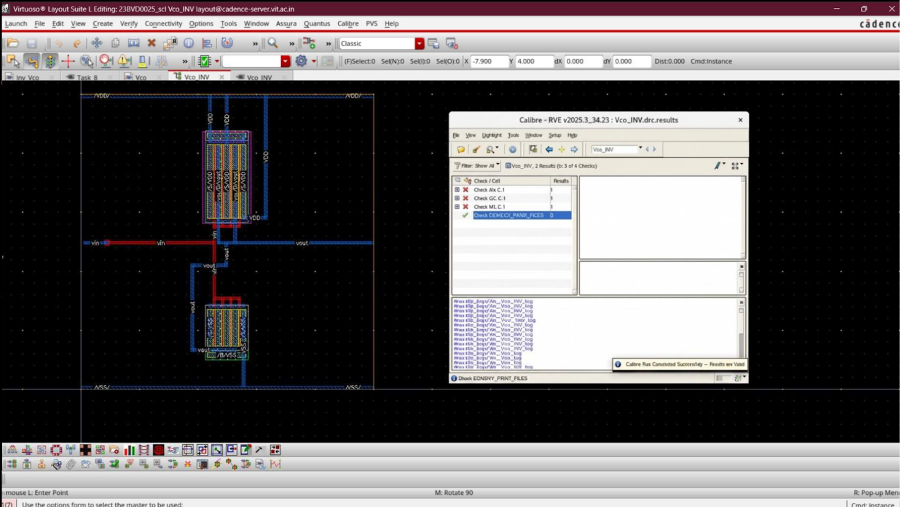
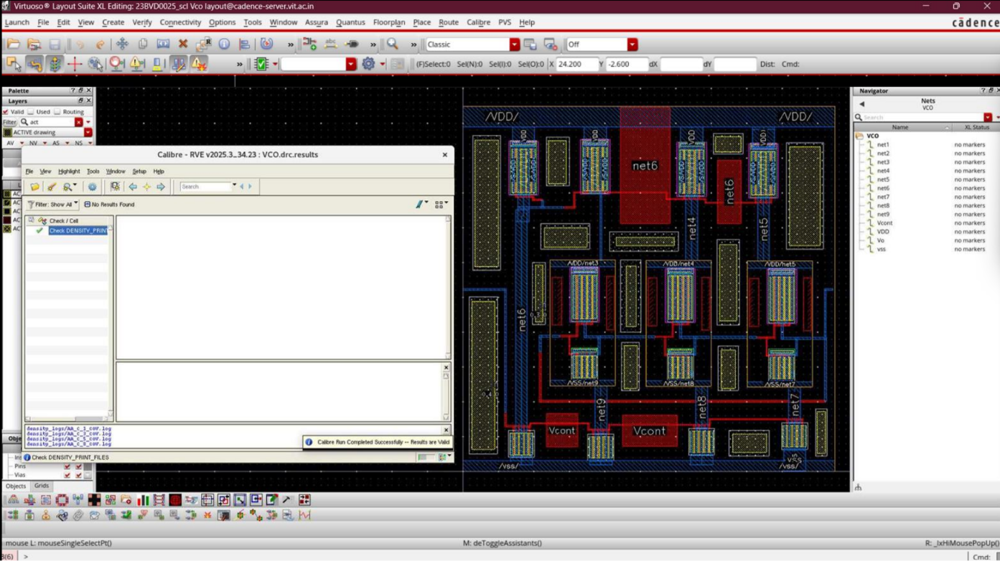
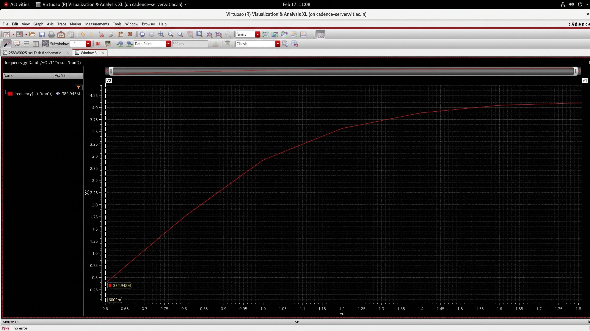
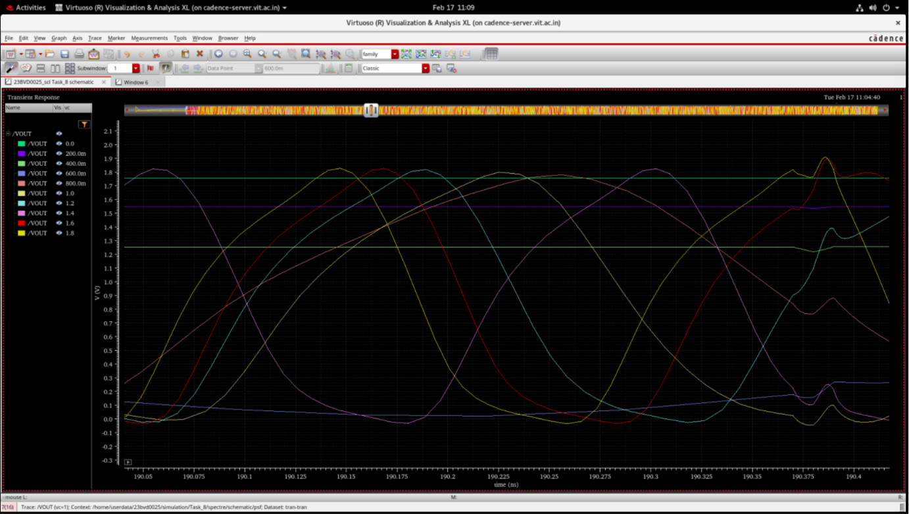

# Design and Implementation of Voltage Controlled Oscillator (VCO)

## Aim
To design and implement a current-starved Voltage Controlled Oscillator (VCO) using SCL 180 nm technology, study its output frequency variation under a swept control voltage, and calculate the VCO gain ($K_{VCO}$) and frequency tuning range.

---

## Overview
The Voltage Controlled Oscillator (VCO) is the frequency-generating core of the Phase-Locked Loop (PLL). It produces a periodic output clock whose frequency is dynamically controlled by the input control voltage ($V_{ctrl}$) coming from the loop filter. 

To achieve high-frequency operation and a wide tuning range, the VCO is implemented as a **current-starved ring oscillator**. The oscillation frequency is set by controlling the charging and discharging currents of each inverter stage using current source networks steered by the control voltage.

---

## Design Specifications & Environment

### Design Specifications
- **Technology Node**: SCL 180 nm CMOS
- **Supply Voltage ($V_{DD}$)**: 1.8 V
- **PMOS Width ($W_p$)**: 100 μm
- **NMOS Width ($W_n$)**: 50 μm
- **Architecture**: 3-Stage Current-Starved Ring Oscillator

### Design Environment
- **Technology Libraries**: `UMC18`, `ts018_scl_prim`, `gpdk090`
- **Tools**: Cadence Virtuoso, Cadence ADE-L (Analog Design Environment), Calibre Physical Verification
- **Analysis Types**: Transient simulation environment and analog waveform viewer

---

## Circuit Architecture & Implementation

The current-starved VCO architecture consists of:
- **PMOS Current Source Network**: Steered current-mirror network that controls the maximum sourcing current of the oscillator stages.
- **NMOS Current Source Network**: Steered current-sink network that controls the maximum sinking current.
- **Cascaded Inverter Stages**: Odd number of current-starved inverter stages in a closed ring configuration to sustain oscillation.
- **Control Voltage Input ($V_{ctrl}$)**: Input node that sets the current mirror gate bias.
- **Output Node ($V_{out}$)**: High-speed output clock signal node.

### Complete VCO Implementation
The transistor-level Cadence Virtuoso schematics and symbols show the stage-by-stage architecture, device interconnections, and bias networks:

#### VCO Inverter Stage Schematic
Transistor-level schematic of the single current-starved inverter stage.

#### VCO Inverter Stage Symbol & Testbench Setup
Symbol block representation of the current-starved inverter cell.

#### Complete VCO Top-Level Schematic
Schematic showing the cascaded 3-stage loop and NMOS/PMOS current steering networks.

#### Complete VCO Symbol & Top-Level Testbench
Top-level hierarchical block with control input ($V_{ctrl}$) and clock output ($V_{out}$) ready for PLL system simulation.

---

## Layout & Physical Verification

### Inverter Stage DRC Verification
Layout of the current-starved inverter cell verified with Calibre DRC, showing zero design rule violations.

### Complete VCO DRC Verification
Physical layout of the 3-stage Voltage Controlled Oscillator verified clean via Calibre DRC check.

---

## Calculations & Performance Metrics

### Characterization Parameters
- **PMOS transistor width ($W_p$)**: 100 μm
- **NMOS transistor width ($W_n$)**: 50 μm
- **Maximum operating frequency ($f_{max}$)**: 4.09 GHz at $V_{max} = 1.8\text{ V}$
- **Minimum operating frequency ($f_{min}$)**: 382.95 MHz at $V_{min} = 600\text{ mV}$

### VCO Gain ($K_{VCO}$) Calculation
The gain of the VCO ($K_{VCO}$) measures the sensitivity of the output frequency to control voltage variations:
$$K_{VCO} = 2\pi \frac{f_{max} - f_{min}}{V_{max} - V_{min}}$$

$$K_{VCO} = 2.15 \times 10^{10}\text{ Hz/V}$$

### Center Frequency ($f_{center}$)
The center frequency is calculated at the midpoint of the tuning range:
$$f_{center} = \frac{f_{max} + f_{min}}{2}$$

$$f_{center} = 2.23\text{ GHz}$$

### Frequency Tuning Range
The frequency tuning range percentage determines the VCO's ability to track phase and frequency variations over PVT corners:
$$\text{Tuning Range} = \frac{f_{max} - f_{min}}{f_{center}} \times 100\%$$

$$\text{Tuning Range} = 165.75\%$$

---

## Simulation & Output Graphs

### Tuning Characteristic Curve ($f_{out}$ vs $V_{ctrl}$)
The tuning response plot displays the output clock frequency as a function of the control voltage $V_{ctrl}$ swept from $0\text{ V}$ to $1.8\text{ V}$.
- **Linear Range**: Strong monotonic frequency increase as control voltage increases.
- **Saturation**: Output frequency approaches saturation at larger control voltages due to transconductance limits.

### Oscillation Waveforms
The transient simulation plot showcases:
- Symmetrical, high-speed, rail-to-rail output oscillation waveforms.
- Multi-stage internal node waveforms demonstrating correct phase progression across the ring oscillator stages.

---

## Inference
The current-starved CMOS Voltage Controlled Oscillator was successfully designed, implemented, and physically verified. 
- Transient and AC simulation results demonstrate that the output oscillation frequency is effectively and monotonically controlled by the input control voltage through current steering mechanisms.
- The circuit shows highly stable oscillations, zero missing cycles, and clean transition characteristics.
- The wide tuning range of **165.75%** and high gain ($K_{VCO} = 2.15 \times 10^{10}\text{ Hz/V}$) verify its suitability for robust, wide-locking-range PLL feedback loops.

---

## Applications
- High-Performance Phase-Locked Loops (PLL)
- High-frequency RF and Digital Frequency Synthesizers
- Clock Generation and Distribution Circuits
- Frequency Modulation (FM) and Clock Recovery Systems
