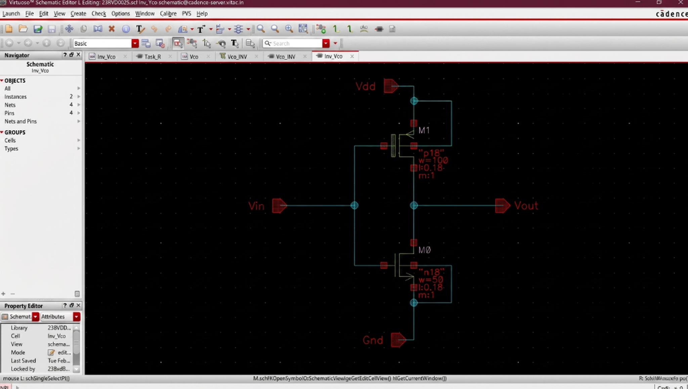
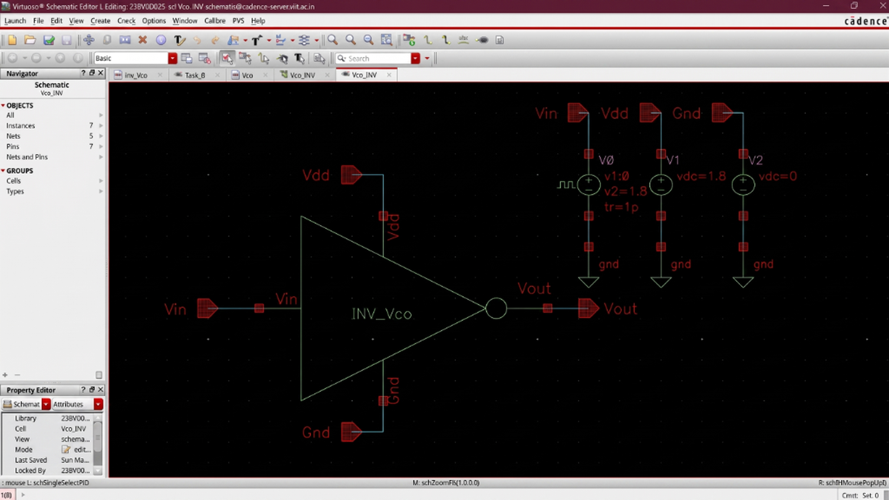
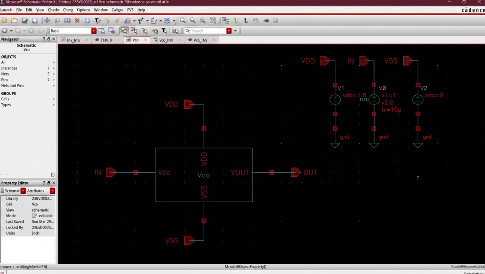
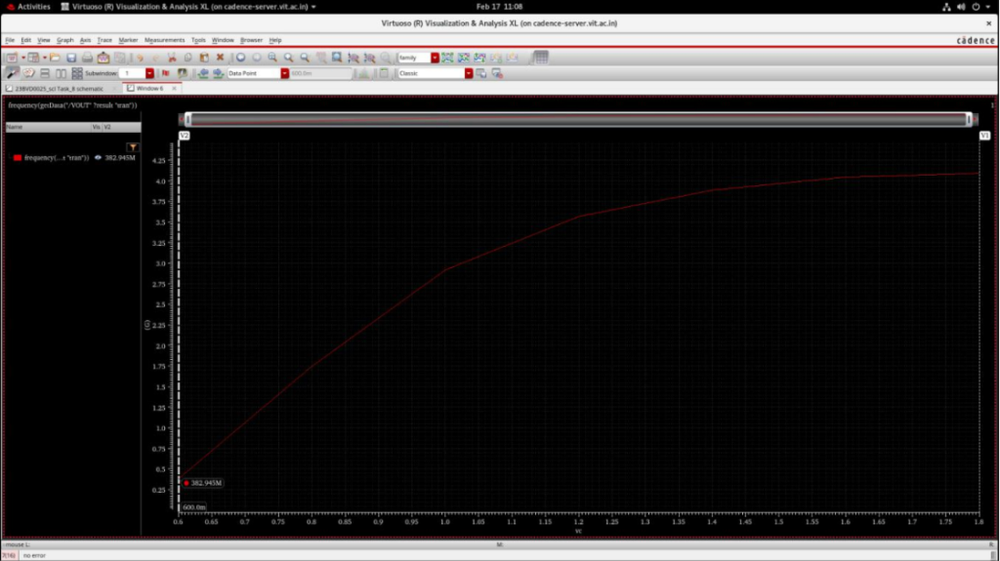
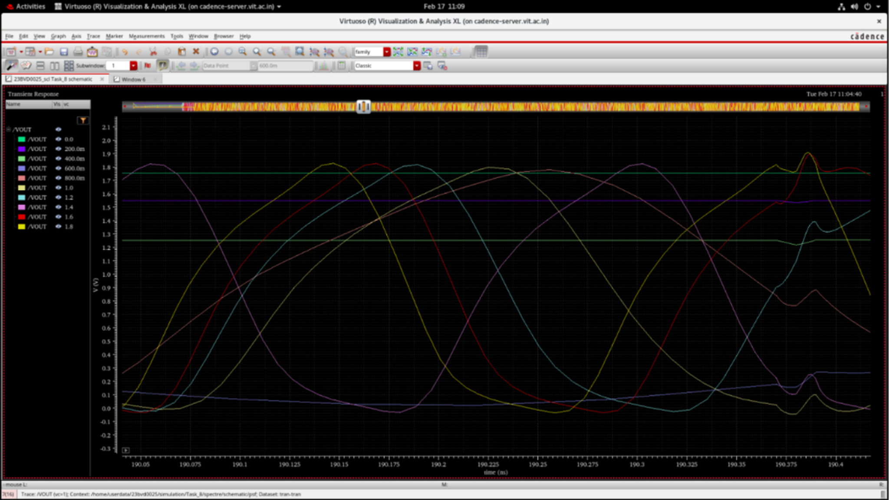

# Voltage Controlled Oscillator (VCO)

## Overview
The Voltage Controlled Oscillator (VCO) is the frequency-generating core of the PLL. It produces an output clock whose frequency is linearly controlled by the input control voltage ($V_{ctrl}$). The VCO is implemented as a **current-starved ring oscillator** using three cascaded current-starved inverter stages (INV_Vco), where the oscillation frequency is set by the bias current flowing through each stage.

The implementation was carried out in SCL 180 nm CMOS technology using Cadence Virtuoso and verified through DRC.

---

## Design Specifications

| Parameter | Value |
|-----------|-------|
| Technology | SCL 180 nm CMOS |
| Supply Voltage | 1.8 V |
| PMOS Width ($W_p$) | 100 $\mu$m |
| NMOS Width ($W_n$) | 50 $\mu$m |
| Architecture | 3-stage current-starved ring oscillator |
| Tool | Cadence Virtuoso |

---

## Performance Summary

| Parameter | Value |
|-----------|-------|
| Maximum Frequency ($f_{max}$) | 4.09 GHz @ $V_{ctrl}$ = 1.8 V |
| Minimum Frequency ($f_{min}$) | 382.95 MHz @ $V_{ctrl}$ = 600 mV |
| Center Frequency ($f_{center}$) | 2.23 GHz |
| VCO Gain ($K_{VCO}$) | $2.15 \times 10^{10}$ rad/s/V |
| Tuning Range | 165.75% |

---

## Circuit Architecture

### VCO Top-Level Schematic
The VCO consists of three cascaded INV_Vco stages with PMOS current sources (M3, M0, M1, M2) on the top rail and NMOS current sinks (M7, M4, M5, M6) on the bottom rail, all controlled by $V_{ctrl}$.

### INV_Vco Current-Starved Inverter Cell
Each inverter stage uses an oversized PMOS (W = 100 $\mu$m) and NMOS (W = 50 $\mu$m) to provide the desired current drive and frequency range.

### INV_Vco Testbench
Standalone testbench used to verify the inverter cell's switching behavior before integration into the ring oscillator.

### VCO Top-Level Testbench
The VCO testbench sweeps the control voltage $V_{ctrl}$ from 600 mV to 1.8 V and records the output frequency to generate the tuning curve.

---

## Design Calculations

### VCO Gain ($K_{VCO}$)
$$K_{VCO} = 2\pi \cdot \frac{f_{max} - f_{min}}{V_{max} - V_{min}}$$
$$K_{VCO} = 2\pi \cdot \frac{4.09\text{ GHz} - 382.95\text{ MHz}}{1.8\text{ V} - 0.6\text{ V}} = 2.15 \times 10^{10} \text{ rad/s/V}$$

### Center Frequency
$$f_{center} = \frac{f_{max} + f_{min}}{2} = \frac{4.09\text{ GHz} + 382.95\text{ MHz}}{2} = 2.23 \text{ GHz}$$

### Tuning Range
$$\text{Tuning Range} = \frac{f_{max} - f_{min}}{f_{center}} \times 100 = 165.75\%$$

---

## Layout & Physical Verification

### INV_Vco Layout (DRC)
The current-starved inverter cell layout was individually verified. The DRC run completed successfully with only density check results.

### VCO Full Layout (DRC)
The complete VCO layout including all three ring stages was verified using Calibre DRC. The result shows **No Results Found**, confirming a DRC-clean implementation.

---

## Simulation & Validation Results

### Frequency vs. Control Voltage (Tuning Curve)
Shows the measured oscillation frequency as a function of $V_{ctrl}$, swept from 600 mV to 1.8 V. The frequency increases monotonically from 382.95 MHz to 4.09 GHz with a characteristic saturation at higher voltages.

### Multi-Voltage Transient Oscillation Waveforms
Shows the output waveform of the VCO at multiple $V_{ctrl}$ values simultaneously (0 V to 1.8 V in 0.2 V steps). Higher control voltages produce visibly faster oscillations, confirming the frequency-voltage relationship.

---

## Validation Summary
- Stable oscillation generated across the full control voltage range (600 mV to 1.8 V).
- Frequency tuning confirmed from 382.95 MHz to 4.09 GHz.
- Monotonic and wide tuning range of 165.75% verified.
- DRC-clean layout verified via Calibre on both the INV_Vco cell and the full VCO.
- VCO gain $K_{VCO} = 2.15 \times 10^{10}$ rad/s/V suitable for PLL integration.

---

## Observations
1. Current-starved topology provides a wide and relatively linear tuning range.
2. Transistor sizing ($W_p = 100\ \mu\text{m}$, $W_n = 50\ \mu\text{m}$) balances drive strength and power consumption.
3. Output frequency saturates at higher $V_{ctrl}$ values due to transistor velocity saturation.
4. Three inverter stages ensure sustained oscillation (odd number required for ring topology).
5. The full VCO layout passed DRC with zero violations.

---

## Applications
- PLL frequency synthesis
- Clock generation circuits
- On-chip clock distribution networks
