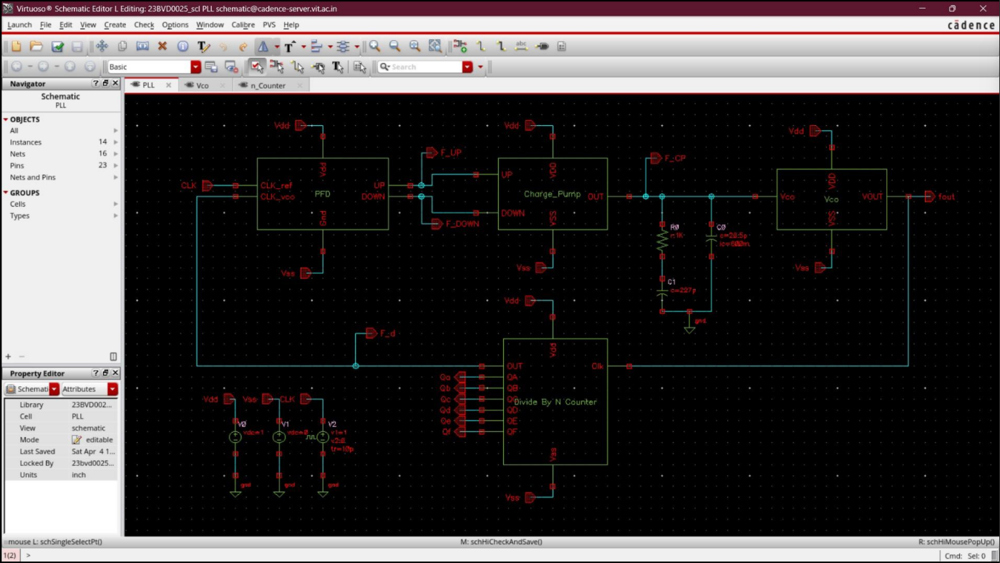
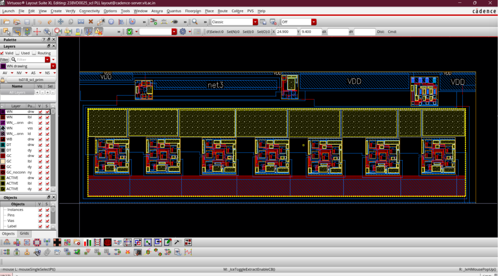
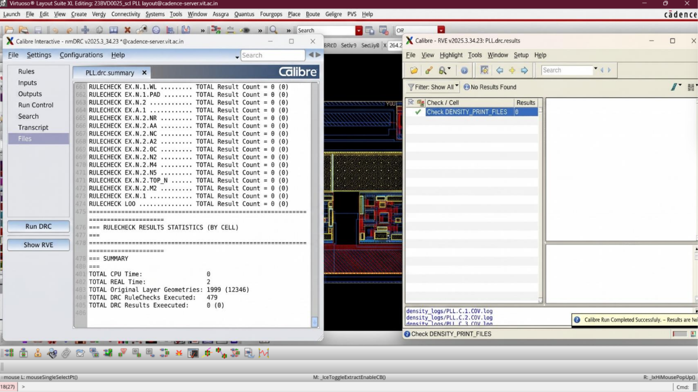
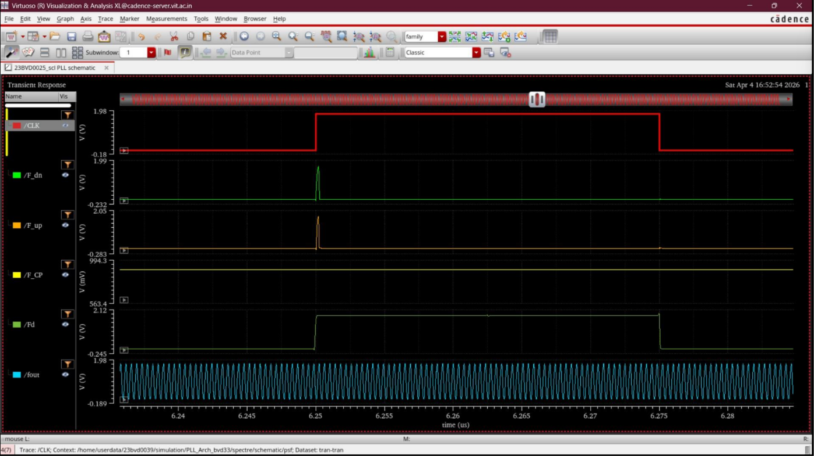

# Phase Locked Loop (PLL) Design and Integration

## Design Objectives & Specifications
To design, implement, and physically verify a complete closed-loop Phase Locked Loop (PLL) architecture using SCL 180 nm CMOS technology. The integrated system generates a stable high-frequency output synchronized with a lower-frequency reference clock.

### System Target Performance
- **Target Output Frequency ($f_{out}$)**: 2.56 GHz
- **Reference Clock Frequency ($f_{ref}$)**: 20 MHz
- **Division Ratio ($N$)**: 128
- **Charge Pump Current ($I_{CP}$)**: 100 μA – 150 μA
- **Loop Filter Parameters**:
  - Resistor ($R$): 1 kΩ
  - Capacitor ($C_1$): 277 pF

---

## Design Environment

- **Core CAD Suite**: Cadence Virtuoso
- **Technology Libraries**: `UMC18`, `ts018_scl_prim`, `gpdk090`
- **Technology Node**: SCL 180 nm CMOS
- **Verification Analysis**: Closed-Loop Transient Analysis, DRC, and LVS

---

## PLL System Architecture

The fully integrated PLL system comprises five key sub-blocks operating in a closed feedback loop:

1. **Phase Frequency Detector (PFD)**: Compares the reference clock ($f_{ref}$) and the feedback divider clock ($f_{fb}$) phases, generating digital **UP** and **DOWN** pulses proportional to the phase/frequency error.
2. **Charge Pump (CP)**: Converts the digital error pulses from the PFD into analog charge/discharge current pulses.
3. **Loop Filter**: A passive low-pass RC network ($R = 1\text{ k}\Omega$, $C = 277\text{ pF}$) that integrates the current pulses to generate a smooth, low-ripple analog control voltage ($V_{ctrl}$).
4. **Voltage Controlled Oscillator (VCO)**: A current-starved ring oscillator that generates a high-frequency output clock ($f_{out}$) proportional to the analog control voltage $V_{ctrl}$.
5. **Divide-by-128 Counter**: A cascaded chain of 7 D-flip-flop toggle stages that divides the VCO output frequency down by a factor of 128 to complete the feedback loop.

---

## Top-Level Schematic Implementation

The complete closed-loop system schematic in Cadence Virtuoso integrates the PFD, Charge Pump, passive Loop Filter, VCO, and Divide-by-128 feedback divider with structured power routing and robust signal interconnections.

---

## Physical Layout & Verification

### Integrated PLL Layout
The complete physical layout of the Phase Locked Loop, featuring isolated sub-block placement and low-impedance power distribution grids.

### Layout vs. Schematic (LVS) & DRC Verification
The integrated design is verified clean via Calibre DRC and LVS checks to confirm strict adherence to SCL 180 nm design rules and absolute schematic-to-layout equivalence.

---

## Simulation & Transient Locking Behavior

### Transient Lock Waveforms
During the initial closed-loop start-up phase, a phase/frequency error exists between the reference clock and the divider feedback signal. The loop filter dynamically adjusts the control voltage ($V_{ctrl}$), pulling the VCO output frequency closer to the target until phase and frequency synchronization are achieved.

### Closed-Loop System Waveforms
The transient simulation plot displays the synchronized behavior across all key internal system nodes under a locked state:
1. Reference clock input ($f_{ref} = 20\text{ MHz}$)
2. PFD UP and DOWN error signals
3. Charge pump output current steps
4. Frequency divider output feedback clock ($f_{fb} = 20\text{ MHz}$)
5. Stabilized VCO output clock ($f_{out} = 2.56\text{ GHz}$)

---

## Performance Summary & Technical Analysis

Closed-loop transient validation confirms the success of the SCL 180 nm PLL design:
- **Phase & Frequency Synchronization**: Achieved complete, stable lock condition with zero cycle slipping.
- **Precise Clock Generation**: Verified output clock frequency of **2.56 GHz** from a **20 MHz** reference clock with a division factor of **128**.
- **Low-Ripple Control Voltage**: The optimized passive loop filter components ($R=1\text{ k}\Omega$, $C=277\text{ pF}$) generate a highly stable analog control voltage with minimal ripple.
- **Symmetric Slew Behavior**: Smooth closed-loop tracking response confirms low current mismatch in the Charge Pump and robust feedback divider operation.

---

## Applications
- High-frequency Clock Generation and Distribution
- RF and Digital Frequency Synthesizers
- High-Speed Mixed-Signal Integrated Circuits
- Communication and Timing Recovery Systems
