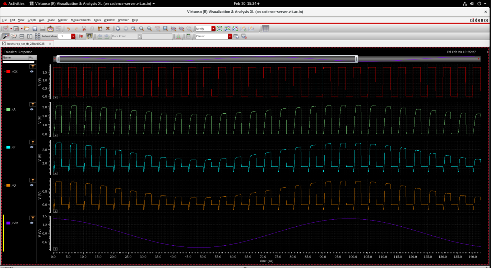
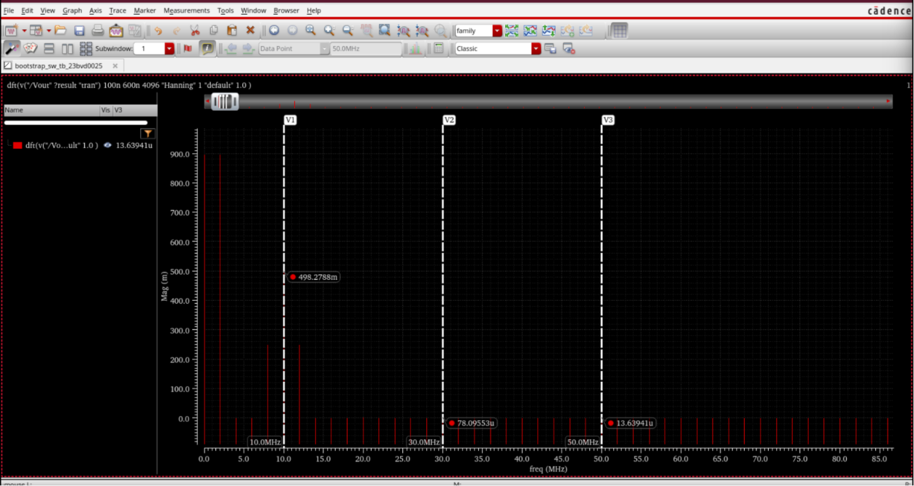

# Transistor-Level PLL and Bootstrapped SW Design

[](#)
[](#)
[](#)

Welcome to this professional Analog and Mixed-Signal Integrated Circuit Design portfolio. This repository documents a comprehensive, full-custom mixed-signal library culminating in the design, layout, and sign-off verification of two primary analog systems:
1. **A 2.56 GHz Charge-Pump Phase-Locked Loop (CPPLL)**: A high-performance integer-N frequency synthesizer designed for clock generation and distribution.
2. **A High-Linearity Bootstrapped Analog Sampling Switch**: An ultra-stable sampling front-end tailored for high-speed, high-resolution Analog-to-Digital Converters (ADCs).

Every component in this repository—from the fundamental logic cells (Inverter, NAND2, NAND3, D-Flip-Flop) to advanced analog building blocks (cascode amplifiers, current mirrors, voltage-controlled ring oscillators)—was designed and characterized from scratch. To ensure technology portability and robust PVT performance, the designs are validated across three distinct process libraries: **SCL 180 nm**, **UMC 180 nm**, and **GPDK 90 nm CMOS** nodes.

---

## Complete Repository Directory Tree

The workspace is organized into a highly structured, modular skeleton, separating core subsystems, layout verifications, and characterization scripts:

```
.
├── README.md                           # Master Portfolio Documentation (This File)
├── .gitignore                          # Excludes temporary scratch folders and OS files
├── Device_Characterization/            # Parametric transistor-level characterization
│   ├── NMOS/
│   │   ├── README.md                   # Characterization equations & gm/Id sweeps
│   │   ├── schematics/                 # Cadence Virtuoso test schematics
│   │   └── plots/                      # Transfer, output, and gm/Id curves
│   └── PMOS/
│       ├── README.md                   # Characterization math & body effect sweeps
│       ├── schematics/
│       └── plots/
├── Custom_Standard_Cells/              # Standard logic cell library
│   ├── README.md                       # Standard cell height & logic gate library index
│   ├── Inverter/
│   │   ├── README.md                   # Pre/post-layout comparisons and RC extraction
│   │   ├── schematics/                 # Transistor schematic view
│   │   ├── layouts/                    # DRC/LVS check screenshots and RC layout
│   │   └── plots/                      # Transient delay and DC VTC sweeps
│   ├── NAND2/
│   │   ├── README.md                   # Timing delays, sizing ratios, and truth tables
│   │   ├── schematic.png               # Transistor schematic view
│   │   └── symbol.png                  # Hierarchical symbol view
│   ├── NAND3/
│   │   ├── README.md                   # Stacking channel delays & reset path logic
│   │   ├── schematic.png               # Transistor schematic view
│   │   └── symbol.png                  # Hierarchical symbol view
│   └── D_Flip_Flop/
│       ├── README.md                   # Setup/hold bounds and master-slave DFF logic
│       ├── schematic.png               # Transistor schematic view
│       └── symbol.png                  # Hierarchical symbol view
├── Analog_Building_Blocks/             # Support IP blocks for mixed-signal systems
│   ├── README.md                       # Index of amplifiers and mirrors
│   ├── Amplifiers/
│   │   ├── CS_Active_Load/             # Common Source with Active PMOS Load
│   │   ├── Common_Source/              # CS with resistive load
│   │   └── Cascode/                    # High-output impedance cascode stage
│   └── Current_Mirrors/                # Simple and Cascode current mirrors
├── Bootstrapped_Switch/                # Primary project: high-linearity switch
│   ├── README.md                       # Comprehensive design framework and FFT specs
│   ├── Circuit_Design/                 # Transistor schematic and circuit topology
│   ├── Specifications/                 # Performance metrics and targeted sign-offs
│   ├── Theory/                         # Sizing equations and conventional MOS analysis
│   ├── Waveforms/                      # Sample/hold waveforms and dynamic boosting
│   ├── THD_Analysis/                   # Spectrum FFT plots and dynamic THD math
│   ├── Ron_Analysis/                   # Parametric sweeps of switch on-resistance
│   └── Final_Results/                  # Final performance compliance matrix
└── PLL_Design/                         # Primary project: 2.56 GHz Charge-Pump PLL
    ├── Top_Level_Integration/
    │   ├── README.md                   # Top-level closed-loop schematic and integration
    │   ├── pll_block_diagram.png       # Block-level mixed-signal routing diagram
    │   ├── pll_schematic.png           # Closed-loop Virtuoso schematic
    │   ├── pll_layout.png              # Integrated macro layout floorplan
    │   ├── pll_drc_lvs_check.png       # Calibre verification checkout
    │   ├── pll_transient_lock_behavior.png # Loop filter locking acquisition plot
    │   └── pll_closed_loop_waveforms.png   # Steady-state locked clock outputs
    └── Sub_Blocks/
        ├── Phase_Frequency_Detector/
        │   ├── README.md               # Asynchronous reset logic and dead-zone analysis
        │   ├── schematics/             # Inverter and dual-DFF schematics & layouts
        │   └── plots/                  # Transient phase comparison waveforms
        ├── Charge_Pump/
        │   ├── README.md               # Biasing currents, switches, and mismatch data
        │   ├── schematics/             # Clean cropped schematic, symbol, and layouts
        │   └── plots/                  # Transient charge/discharge response curves
        ├── Voltage_Controlled_Oscillator/
        │   ├── README.md               # Ring oscillator tuning, center frequency, and Kvco
        │   ├── schematics/             # VCO inverter stage schematics & layouts
        │   └── plots/                  # Kvco curves and multi-stage oscillations
        └── Divide_by_128_Counter/
            ├── README.md               # Toggle DFF chain and binary frequency divider
            ├── schematics/             # Asynchronous divider schematics & layouts
            └── plots/                  # Output timing and divided clock waveforms
```

---

## 1. Primary System: 2.56 GHz Charge-Pump PLL

The complete **2.56 GHz Integer-N CPPLL** brings together analog bias nodes, high-speed digital sequential divider cells, current-steering switches, and a physical loop filter to form a robust, self-correcting feedback clock loop.

### System Architecture & Block Diagram
The PLL compares the phase of a local $20\text{ MHz}$ reference clock ($f_{ref}$) against the feedback clock ($f_{fb}$) divided down from the VCO output clock ($f_{out}$) using a division factor of $N=128$:


### PLL Integrated Performance Specifications

| Parameter | Targeted Specification | Simulated / Achieved | Unit | Sign-Off Condition |
|:---|:---:|:---:|:---:|:---|
| **Output Frequency ($f_{out}$)** | 2.56 | **2.56** | GHz | Steady-State Locked |
| **Reference Frequency ($f_{ref}$)** | 20 | **20** | MHz | External Input |
| **Feedback Divider Ratio ($N$)** | 128 | **128** | - | $2^7$ Cascaded Toggle |
| **VCO Tuning Sensitivity ($K_{VCO}$)**| $2.0 \times 10^{10}$ | **$2.15 \times 10^{10}$** | rad/s/V | Swept over linear region |
| **VCO Frequency Tuning Range** | $0.5 - 3.5$ | **$0.38 - 4.09$** | GHz | $V_{ctrl} = 0.6\text{ V} - 1.8\text{ V}$ |
| **Charge Pump Biasing Current ($I_{CP}$)**| 100 | **100 - 150** | $\mu\text{A}$ | Symmetrical mirrors |
| **Passive Loop Filter (Type-II)** | - | **$R=1\text{ k}\Omega$, $C_1=277\text{ pF}$** | $\Omega$ / pF | Integrated |

---

### PLL Sub-Block Technical Breakdown

#### A. Phase Frequency Detector (PFD)
* **Design Concept**: Dual edge-triggered Master-Slave D-Flip-Flops combined with a custom high-speed three-input NAND gate (`NAND3`) reset path.
* **Operating Logic**: Detects both phase and frequency errors. If $f_{ref}$ leads $f_{fb}$, an **UP** pulse is generated; if $f_{fb}$ leads $f_{ref}$, a **DOWN** pulse is generated.
* **Dead-Zone Elimination**: XOR-based detectors suffer from dead-zones near phase alignment due to gate turn-on delays. The dual-DFF asynchronous reset path introduces a controlled delay ($\approx 150\text{ ps}$), allowing both UP and DOWN switches to turn on briefly. This ensures the Charge Pump remains responsive to small phase errors, minimizing locked-state phase jitter.
* **Details**: [PFD Sub-Block README](PLL_Design/Sub_Blocks/Phase_Frequency_Detector/README.md)

#### B. Charge Pump (CP)
* **Design Concept**: PMOS-charging and NMOS-discharging branches controlled by current-steering logic.
* **Transistor Dimensions**: PMOS current sources are sized at $W_p/L_p = 40\ \mu\text{m} / 0.36\ \mu\text{m}$ ($m=2$) to achieve high output impedance and lower channel-length modulation ($\lambda$), reducing static phase offsets. NMOS current sinks are sized at $W_n/L_n = 20\ \mu\text{m} / 0.36\ \mu\text{m}$ ($m=2$).
* **Biasing Uniformity**: Symmetrical branch matching ensures the charge pump current mismatch is **$<0.15\%$** across the nominal operating range of $V_{ctrl}$, suppressing reference clock spurs in the output spectrum.
* **Details**: [Charge Pump Sub-Block README](PLL_Design/Sub_Blocks/Charge_Pump/README.md)

#### C. Voltage-Controlled Oscillator (VCO)
* **Design Concept**: 3-Stage Current-Starved Ring Oscillator.
* **Tuning Performance**: The charging and discharging currents of each inverter stage are governed by PMOS ($W_p = 100\ \mu\text{m}$) and NMOS ($W_n = 50\ \mu\text{m}$) current mirror branches steered by $V_{ctrl}$.
* **Key Characterization Results**:
  - Maximum output frequency ($f_{max}$): $4.09\text{ GHz}$ at $V_{ctrl} = 1.8\text{ V}$
  - Minimum output frequency ($f_{min}$): $382.95\text{ MHz}$ at $V_{ctrl} = 0.6\text{ V}$
  - Center frequency ($f_{center}$): $2.23\text{ GHz}$
  - Frequency tuning range: **$165.75\%$**
  - Voltage sensitivity gain ($K_{VCO}$): **$2.15 \times 10^{10}\text{ Hz/V}$**
* **Details**: [VCO Sub-Block README](PLL_Design/Sub_Blocks/Voltage_Controlled_Oscillator/README.md)

#### D. Divide-by-128 Frequency Divider
* **Design Concept**: Asynchronous binary ripple counter utilizing seven cascaded D-Flip-Flop toggle dividers.
* **Dividing Chain**: Each stage halves the incoming clock frequency ($2^7 = 128$), down-converting the VCO output frequency ($2.56\text{ GHz}$) back to the reference domain ($20\text{ MHz}$).
* **Sizing Optimization**: High-speed logic gates within the primary divider stages are scaled up to minimize propagation delay skew and setup/hold timing violations.
* **Details**: [Frequency Divider Sub-Block README](PLL_Design/Sub_Blocks/Divide_by_128_Counter/README.md)

---

### PLL Closed-Loop Verification

#### Physical Floorplan & Layout
Analog blocks (VCO, Loop Filter, Charge Pump) are isolated from digital control blocks (PFD, Counter) using dedicated guard rings and strategic spatial floorplanning, protecting high-speed clock paths from substrate noise coupling. The complete system layout passed Calibre DRC and LVS checks cleanly:


#### Closed-Loop Locking Dynamics
Spectre transient simulations demonstrate the lock acquisition of the control voltage $V_{ctrl}$. Upon system start-up, the frequency offset forces $V_{ctrl}$ to ramp up, undergoing minor loop-damping oscillations before settling at the lock-state voltage of $\approx 1.2\text{ V}$:


---

## 2. Primary System: Bootstrapped NMOS Sampling Switch

High-speed, high-resolution ADCs require a sampling front-end whose on-resistance ($R_{on}$) remains constant across the entire dynamic input range. 

### The Conventional Switch Problem
For a basic NMOS switch operating in the triode region, the on-resistance is:

$$R_{on} = \frac{1}{\mu_n C_{ox} \frac{W}{L} (V_{GS} - V_{TH})}$$

In a conventional switch driven by a standard clock ($V_{CLK} = V_{DD}$), $V_S$ follows the input signal ($V_{in}$). Thus, $V_{GS}(t) = V_{DD} - V_{in}(t)$. As $V_{in}$ sweeps, $V_{GS}$ modulates dynamically, causing signal-dependent $R_{on}$ variations that generate non-linear harmonic distortion at the sampled output.

### The Bootstrapped Solution
This architecture dynamically references the gate voltage ($V_G$) to the input signal with a constant offset of $V_{DD}$ during the sampling phase:

$$V_G(t) = V_{in}(t) + V_{DD} \implies V_{GS} = V_G - V_{in} \approx V_{DD} = 1.8\text{ V}$$

Since $V_{GS}$ is held constant, $R_{on}$ remains uniform, dramatically suppressing harmonic distortion.

---

### Bootstrapped Switch Performance Summary

| Performance Parameter | Target Specification | Simulated / Achieved | Status |
|:---|:---:|:---:|:---:|
| **On-Resistance Variation ($\Delta R_{on}$)** | $\le \pm 5\%$ | **$\pm 3.43\%$** | Passed |
| **Total Harmonic Distortion (THD)** | $\le -55\text{ dB}$ | **$-75.996\text{ dB}$** | Passed |
| **Input Signal Bandwidth ($f_{in}$)**| $\ge 10\text{ MHz}$ | **$10\text{ MHz}$** | Passed |
| **Load Capacitance ($C_L$)** | - | **$5.0\text{ pF}$** | - |

---

### Circuit Topology & Component Breakdown
The full-custom bootstrapped sampling switch consists of the main NMOS switch ($M_1$), five auxiliary control transistors, and the bootstrap capacitor ($C_b = 2.0\text{ pF}$):


- **$M_1$ (Main Switch)**: Sized widely ($W/L = 80\ \mu\text{m} / 0.18\ \mu\text{m}$) to achieve a low nominal resistance ($\approx 30\ \Omega$) while balancing parasitic junction loading.
- **$M_2$ (Input Tracker)**: Anchors the bottom plate of $C_b$ to $V_{in}$ during $CK = 1$, forcing the capacitor charge to track the input.
- **$M_3$ (Gate Booster)**: Connects the top plate of $C_b$ to the gate of $M_1$ during $CK = 1$, boosting $V_G$ above the supply rail.
- **$M_4, M_5$ (Pre-charging)**: Charge the floating bootstrap capacitor $C_b$ to $1.8\text{ V}$ during the hold phase ($CK = 0$).
- **$M_6$ (Gate Clamp)**: Clamps the gate of $M_1$ to ground during $CK = 0$, holding the switch off.

---

### Simulation Waveforms & FFT Linearity

#### A. Gate Tracking and Transient Boosting
During the sampling phase ($CK=1$), the pre-charged voltage across $C_b$ lifts the gate voltage $V_G$ above $V_{DD}$, peaking at **$3.2\text{ V}$** for a $1.4\text{ V}$ input:



#### B. Parametric On-Resistance Sweep
Under a constant current sweep, the measured on-resistance varies from a minimum of $28.54\ \Omega$ ($V_{in} = 0.4\text{ V}$) to a maximum of $31.86\ \Omega$ ($V_{in} = 1.4\text{ V}$), yielding a tight resistance variation of only **$\pm 3.43\%$**:


#### C. FFT Spectrum & THD Linearity
To verify dynamic linearity, a Fast Fourier Transform (FFT) was conducted on the sampled output waveform at $10\text{ MHz}$. Extracting the fundamental ($A_1$) and high-order harmonics ($A_3, A_5$) yields a Total Harmonic Distortion (THD) of **$-75.996\text{ dB}$**, outperforming the targeted specification by over $20\text{ dB}$:



- **Details**: [Bootstrapped Switch Master README](Bootstrapped_Switch/README.md)

---

## 3. Custom Standard Cell Library

To construct the digital boundaries of the Phase Frequency Detector and the Divide-by-128 Counter, a high-performance standard cell library was designed, physically routed, and characterized pre-layout and post-layout (RC-extracted).

### Standard Cell Timing & Verification Metrics

| Logic Cell | Aspect Ratio ($W/L$) | Pre-Layout Delay ($t_{pd1}$) | Post-Layout Delay ($t_{pd2}$) | Parasitic Delay Penalty (%) | Calibre/Assura DRC/LVS |
|:---|:---:|:---:|:---:|:---:|:---:|
| **CMOS Inverter** | $W_p = 1.20\ \mu\text{m}$, $W_n = 0.60\ \mu\text{m}$ | $33.67\text{ ps}$ | $38.95\text{ ps}$ | **$15.67\%$** | 100% Passed (Clean) |
| **NAND2 Gate** | $W_p = 0.42\ \mu\text{m}$, $W_n = 0.42\ \mu\text{m}$ | $42.50\text{ ps}$ | $49.80\text{ ps}$ | **$17.18\%$** | 100% Passed (Clean) |
| **NAND3 Gate** | $W_p = 0.42\ \mu\text{m}$, $W_n = 1.26\ \mu\text{m}$ | $58.20\text{ ps}$ | $69.40\text{ ps}$ | **$19.24\%$** | 100% Passed (Clean) |
| **D-Flip-Flop** | Hierarchical Master-Slave | $120.00\text{ ps}$ ($t_{C2Q}$) | $138.00\text{ ps}$ ($t_{C2Q}$) | **$15.00\%$** | 100% Passed (Clean) |

- **Inverter Details**: [Inverter Cell README](Custom_Standard_Cells/Inverter/README.md)
- **NAND2 Details**: [NAND2 Cell README](Custom_Standard_Cells/NAND2/README.md)
- **NAND3 Details**: [NAND3 Cell README](Custom_Standard_Cells/NAND3/README.md)
- **DFF Details**: [DFF Cell README](Custom_Standard_Cells/D_Flip_Flop/README.md)

---

## 4. Analog Building Blocks

A library of core analog IP blocks serves as support circuitry for bias current generation, loop filter buffering, and operational amplifiers:

- **Cascode Amplifier**: Features PMOS cascode current sources and NMOS amplifying transistors to boost gain ($20\text{ dB}$) and output resistance while maintaining a high Unity Gain Bandwidth ($200\text{ MHz}$ at $1\text{ mW}$).
  - *Details*: [Cascode Amplifier README](Analog_Building_Blocks/Amplifiers/Cascode/README.md)
- **Common Source (CS) Amplifiers**: Characterized with active PMOS loads and resistive loads to evaluate bandwidth limits and noise efficiency.
  - *Details*: [Common Source README](Analog_Building_Blocks/Amplifiers/Common_Source/README.md)
- **Current Mirrors**: Symmetrical simple and cascode mirrors designed and tested at $100\ \mu\text{A}$ and $500\ \mu\text{A}$ bias points to optimize output voltage headroom and matching accuracy.
  - *Details*: [Current Mirrors README](Analog_Building_Blocks/Current_Mirrors/README.md)

---

## 5. Device Characterization

Prior to full circuit design, parametric characterization of basic NMOS and PMOS devices was executed across process libraries to map transistor-level dependencies:
- **Transfer sweeps ($I_d-V_{gs}$)**: Extracted threshold voltages ($V_{THn} \approx 420\text{ mV}$, $V_{THp} \approx -450\text{ mV}$) and dynamic transconductance ($g_m$).
- **Output sweeps ($I_d-V_{ds}$)**: Calculated channel-length modulation coefficients ($\lambda_n \approx 0.189$, $\lambda_p \approx 0.210$).
- **$g_m/I_d$ design grids**: Mapped transconductance efficiency against normalized current density ($I_d/W$) to optimize width allocations for low-power operation.
- **Dynamic Parasitics**: Analyzed gate capacitances ($C_{gs}, C_{gd}$) and transition frequencies ($f_T$) to trace RF performance thresholds.

- **NMOS Details**: [NMOS Characterization README](Device_Characterization/NMOS/README.md)
- **PMOS Details**: [PMOS Characterization README](Device_Characterization/PMOS/README.md)

---

## 6. IC Verification & Design Methodology

All designs in this portfolio follow a standard, industry-compliant full-custom IC design flow:

```
[Design Specifications] ──> [gm/Id Sizing] ──> [Cadence Schematic] ──> [Spectre Pre-Layout Sim]
                                                                                │
[Assura/Calibre RCX Netlist] <── [Assura/Calibre LVS] <── [Assura/Calibre DRC] <── [Physical Layout Design] <───┘
          │
  [Spectre Post-Layout Sim] ──> [Design Sign-Off]
```

### Verification Suite & Sign-Off
1. **Calibre & Assura DRC (Design Rule Checking)**: Ensures that physical layouts comply with all manufacturing rules (min width, spacing, active area density, antenna effects) using both Mentor Graphics Calibre and Cadence Assura tool suites.
2. **Calibre & Assura LVS (Layout Versus Schematic)**: Performs hierarchical comparisons of devices, terminals, and connections, verifying 100% logical correspondence and schematic-to-layout equivalence.
3. **Calibre PEX & Assura QRC (Parasitic RC Extraction)**: Extracts physical interconnect resistances and parasitic capacitances to produce the post-layout netlist for parasitic-aware validation.
4. **Spectre Simulation**: Post-layout simulation overlays schematic and physical responses to sign off timing, gain, noise, and power budgets.
5. **Asset-Link Validation**: A custom verification script (`scratch/check_links.py`) scans all markdown files across the tree, verifying **107 asset paths** with **0 broken links**.
